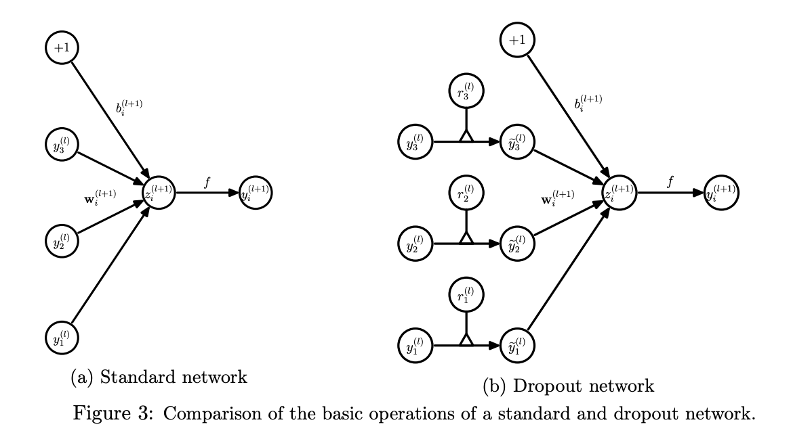
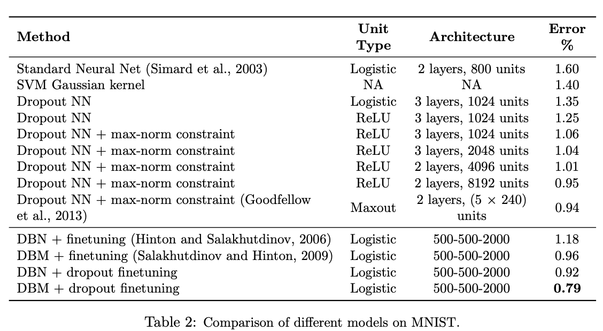
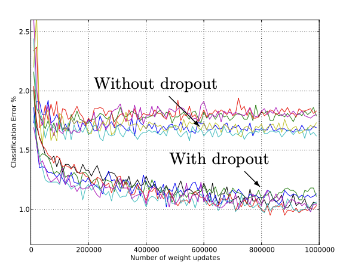
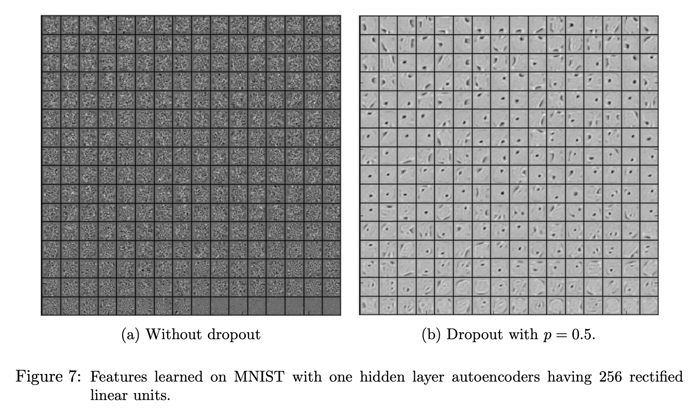
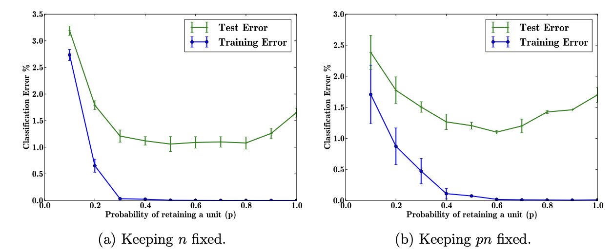
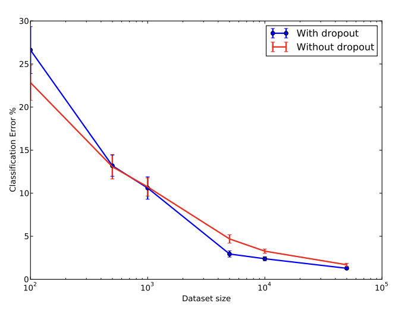

# Dropout

📜 [Dropout: A Simple Way to Prevent Neural Networks from Overfitting](https://jmlr.org/papers/volume15/srivastava14a/srivastava14a.pdf)

> With limited training data, however, many of these complicated relationships will be the result of sampling noise, so they will exist in the training set but not in real test data even if it is drawn from the same distribution. This leads to overfitting and many methods have been developed for reducing it.

A deep neural network will learn complex relationships observed within the training data, but many of these relationships will be due to noise and not true behaviors in the data-generating distribution, leading to overfitting.

> With unlimited computation, the best way to “regularize” a fixed-sized model is to average the predictions of all possible settings of the parameters, weighting each setting by its posterior probability given the training data.

If we had infinite computation, the best possible way to achieve regularization would be to average the predictions of every possible configuration of the parameters of the model weighted by how accurate the predictions of each model are with the training set.

In practice, this means that averaging the predictions of all the configurations of the model that actually accurately predict the results in the training set (all possible interpretations of the training data).

The commonalities between these models would be the actual properties of the data generating distribution, and the differences (cancelled out by the averages) represent the degrees of freedom/inaccuracies that come from noise.

> We would like to approach the performance of the Bayesian gold standard using considerably less computation. We propose to do this by approximating an equally weighted geometric mean of the predictions of an exponential number of learned models that share parameters.

A far more computationally efficient method than creating a large amount of separate models, trained separately, and then using this “ensemble” approach for prediction.

> Model combination nearly always improves the performance of machine learning methods.

> With large neural networks, however, the obvious idea of averaging the outputs of many separately trained nets is prohibitively expensive.

Having many models is the gold-standard (shows up in multi-headed attention), but the real constraint here is compute.

> Combining several models is most helpful when the individual models are different from each other and in order to make neural net models different, they should either have different architectures or be trained on different data.

A design philosophy. Seems like this does not correspond with multi-headed attention though.

> Training many different architectures is hard because finding optimal
> hyper-parameters for each architecture is a daunting task and training each large network requires a lot of computation.

> Moreover, large networks normally require large amounts of
> training data and there may not be enough data available to train different networks on different subsets of the data.

In practice, training multiple models is hard because there isn’t enough data, and hyper-parameter tuning all of them to be sufficiently different is hard.

> Dropout is a technique that addresses both these issues. It prevents overfitting and provides a way of approximately combining exponentially many different neural network architectures efficiently.

> Applying dropout to a neural network amounts to sampling a “thinned” network from it.

Dropout just involves killing some percentage of the neurons on each training step (turning them off).

> The idea is to use a single neural net at test time without dropout. The weights of this network are scaled-down versions of the trained weights. If a unit is retained with probability p during training, the outgoing weights of that unit are multiplied by p at test time.

All neurons are used at test time, just scaling the weights down by the same factor as the percentage of neurons dropped out during training.

### Motivation

> A motivation for dropout comes from a theory of the role of sex in evolution.

> One possible explanation for the superiority of sexual reproduction is that, over the long term, the criterion for natural selection may not be individual fitness but rather mix-ability of genes. The ability of a set of genes to be able to work well with another random set of genes makes them more robust. Since a gene cannot rely on a large set of partners to be present at all times, it must learn to do something useful on its own or in collaboration with a small number of other genes.

> Similarly, each hidden unit in a neural network trained with dropout must learn to work with a randomly chosen sample of other
> units. This should make each hidden unit more robust and drive it towards creating useful features on its own without relying on other hidden units to correct its mistakes.

> However, the hidden units within a layer will still learn to do different things from each other

Cool, and interesting - but these all look like a post-rationalization of the strategy that worked empirically. Was this actually even what led to the idea? Or is this just a narrative added onto it retrospectively?

### Related Work

> Our work extends this idea by showing that dropout can be effectively
> applied in the hidden layers as well and that it can be interpreted as a form of model averaging.

> In dropout, we minimize the loss function stochastically under a noise distribution. This can be seen as minimizing an expected loss function.

### Model Description

In dropout, you just sample from a distribution to decide whether each neuron will actually contribute its output to the next layer.

### Learning Dropout Nets

**1. Backpropagation**

> Dropout neural networks can be trained using stochastic gradient descent in a manner similar to standard neural nets. The only difference is that for each training case in a mini-batch, we sample a thinned network by dropping out units. Forward and backpropagation for that training case are done only on this thinned network.

> One particular form of regularization was found to be especially useful for dropout—constraining the norm of the incoming weight vector at each hidden unit to be upper bounded by a fixed constant c.

While dropout only selects a subset of input neurons as its input, the max-norm constraint makes sure that the remaining active inputs don’t have inputs of too large a magnitude by making sure they’re scaled below a certain max constant.

> Although dropout alone gives significant improvements, using dropout along with max-norm regularization, large decaying learning rates and high momentum provides a significant boost over just using dropout.

### Experimental Results

> We found that dropout improved generalization performance on all data sets compared to neural networks that did not use dropout.

### Salient Features

> The advantages obtained from dropout vary with the probability of retaining units, size of the network, and the size of the training set.

**1. Effect on Features**

> Therefore, units may change in a way that they fix up the mistakes of the other units. This may lead to complex co-adaptations. This in turn leads to overfitting because these co-adaptations do not generalize to unseen data.

Units can co-adapt with each others predictions, which we don’t want because they are ungeneralized (they fix issues in the training set, but aren’t necessarily learning individually robust features).

> We hypothesize that for each hidden unit, dropout prevents co-adaptation by making the presence of other hidden units unreliable.

Hidden units have to perform well on their own in a wide variety of context since they can’t depend on the presence of any other specific neurons.

The results of the below chart are insane. The level of robustness and specificity of features promoted by dropout is so clear.

**2. Effect on Sparsity**

> We found that as a side-effect of doing dropout, the activations of the hidden units become sparse, even when no sparsity inducing regularizers are present. Thus, dropout automatically leads to sparse representations.

> In a good sparse model, there should only be a few highly activated units for any data case.

You want different neurons/groups of neurons to learn independent features, and have them fire separately (sparsity & linear separability).

**3. Effect of Dropout Rate**

It appears that $0.4 \leq p \leq 0.8$ appears to be optimal. Factoring in scaling the network size to be appropriate for different $p$ values, it appears that $p = 0.6$ is around optimal.

**4. Effect of Data Set Size**

> One test of a good regularizer is that it should make it possible to get good generalization error from models with a large number of parameters trained on small data sets.

Good regularization should mean that even a large model with a lot of capacity to potentially overfit, still does not actually overfit.

> As the size of the data set is increased, the gain from doing dropout increases up to a point and then declines.

> This suggests that for any given architecture and dropout rate, there is a “sweet spot” corresponding to some amount of data that is large enough to not be memorized in spite of the noise but not so large that overfitting is not a problem anyways.

### Multiplicative Gaussian Noise

> Dropout involves multiplying hidden activations by Bernoulli distributed random variables which take the value 1 with probability p and 0 otherwise. This idea can be generalized by multiplying the activations with random variables drawn from other distributions.

The idea of dropout doesn’t require the Bernoulli distribution - it requires sampling from any external distribution to mask some percentage of the neurons at each training step.

> We recently discovered that multiplying by a random variable drawn from N (1, 1) works just as well, or perhaps better than using Bernoulli noise.

Sample from the Gaussian distribution appears to work just as well.

### Conclusion

> This technique was found to improve the performance of neural nets in a wide variety of application domains including object classification, digit recognition, speech recognition, document classification and analysis of computational biology data.

> This suggests that dropout is a general technique and is not specific to any domain.

> One of the drawbacks of dropout is that it increases training time. A dropout network typically takes 2-3 times longer to train than a standard neural network of the same architecture. A major cause of this increase is that the parameter updates are very noisy. Each training case effectively tries to train a different random architecture. Therefore, the gradients that are being computed are not gradients of the final architecture that will be used at test time.

Dropout takes significantly longer in training time (increases time to convergence) because gradient descent is effectively trying to train many different networks at once.

> However, it is likely that this stochasticity prevents overfitting. This creates a trade-off between overfitting and training time. With more training time, one can use high dropout and suffer less overfitting.
