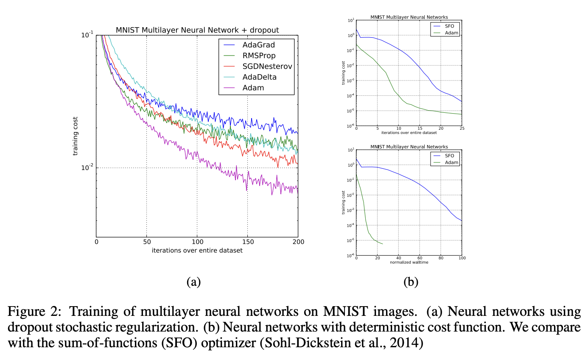

# Adam

📜 [Adam: A Method for Stochastic Optimization](https://arxiv.org/pdf/1412.6980)

> The method is straightforward to implement, is computationally efficient, has little memory requirements, is invariant to diagonal rescaling of the gradients, and is well suited for problems that are large in terms of data and/or parameters.

> The hyper-parameters have intuitive interpretations and typically require little tuning.

> The focus of this paper is on the optimization of stochastic objectives. with high-dimensional parameters spaces.

> We propose Adam, a method for efficient stochastic optimization that only requires first-order gradients with little memory requirement. The method computes individual adaptive learning rates for different parameters from estimates of first and second moments of the gradients; the name Adam is derived from adaptive moment estimation.

The Adam optimizer combines the advantages of the AdaGrad and RMSProp optimization methods which came before it.

> Some of Adam’s advantages are that the magnitudes of parameter updates are invariant to rescaling of the gradient, its step-sizes are approximately bounded by the step-size hyper-parameter, it does not require a stationary objective, it works with sparse gradients, and it naturally performs a form of step size annealing.

### Algorithm

> The algorithm updates exponential moving averages of the gradient $(m_t)$ and the squared gradient $(v_t)$ where the hyper-parameters $\beta_1, \beta_2 \in [0, 1)$ control the exponential decay rates of these moving averages.

> The moving averages themselves are estimates of the 1st moment (the mean) and the 2nd raw moment (the uncentered variance) of the gradient.

**1. Adam’s Update Rule**

> An important property of Adam’s update rule is its careful choice of step-sizes.

> The effective step taken in parameter space at time-step $t$ is:
> $\Delta_t = \alpha \cdot \hat{m}_t / \sqrt{\hat{v}_t} + \hat{\epsilon}$

> The effective magnitude of the steps taken in parameter space at each time-step are approximately bounded by the step-size setting $\alpha$. This can be understood as establishing a trust region around the current parameter value, beyond which the current gradient estimate does not provide sufficient information.

The step-size, although estimated by the momentum, is effectively capped by the $alpha$ hyper-parameter.

> We often know in advance that good optima are with high probability within some set region in parameter space.

> We can often deduce the right order of magnitude of α such that optima
> can be reached from $\theta_0$ within some number of iterations.

Given that the optimal point is known to be within some sub-space, and the initial parameters can be known, it’s relatively tractable to estimate a good value of $\alpha$ for $\theta_0$ to converge within a given number of iterations.

> We will call the ratio $\hat{m}_t / \sqrt{\hat{v}_t}$ the _signal-to-noise_ ratio (SNR)

This value approximates how much the recent gradients have been pointing in the same direction/moving the same way vs. moving all over the place, which is a good approximation of how certain we can be that the current direction is the true correct gradient.

Then if it is, this should increase our step-size.

> For example, the SNR value typically becomes closer to 0 towards an optimum, leading to smaller effective steps in parameter space.

### Initialization Bias Correction

We can represent the update at time-step $t$ of the exponential moving average of the second moment as $v_t = (1 - \beta_2) \sum_{i=0}^{t} \beta_2^{t-i} \cdot g_t^2$.

However, there is an initial bias toward the initialization term (0) even though the correct moment is unlikely to actually be 0 (we just set to 0 naively). Because of this, we want to correct for the effect of this moment in the initial runs since it will be contributing $\beta_2^t$ of the moving average which is significant early on - so we want to divide by the $(1 - \beta_2^t)$ term to correct for this bias.

This means that the multiple on the other terms will be $\frac{\beta_2^{t-k}}{(1 - \beta_2^t)}$ for the $k$-th most recent term. This ratio expresses the fraction of the _remaining_ moments we want to take into account in our moving average aside from the fraction that the original (incorrect) 0 moment takes up in our calculation.

As we get farther into the future the denominator will get closer and closer to one as $B_2^t$ converges toward 0, since the effect of the original bias term becomes negligible, the bias correction will have a negligible effect.

### Related Work

**1. RMSProp**

> There are a few important differences between RMSProp with momentum and Adam: RMSProp with momentum generates its parameter updates using a momentum on the rescaled gradient, whereas Adam updates are directly estimated using a running average of first and second moment of the gradient.

**2. AdaGrad**

> AdaGrad corresponds to a version of Adam with $\beta_1 = 0$, infinitesimal $(1 - \beta_2)$ and a replacement of $\alpha$ by an annealed version $\alpha_t = \alpha \cdot t^{-1/2}$.

### Experiments

> Using large models and datasets, we demonstrate Adam can efficiently solve practical deep learning problems.

### Conclusion

> We have introduced a simple and computationally efficient algorithm for gradient-based optimization of stochastic objective functions.

> Our method is aimed towards machine learning problems with large datasets and/or high-dimensional parameter spaces.

> The method combines the advantages of two recently popular optimization methods: the ability of AdaGrad to deal with sparse gradients, and the ability of RMSProp to deal with non-stationary objectives.
