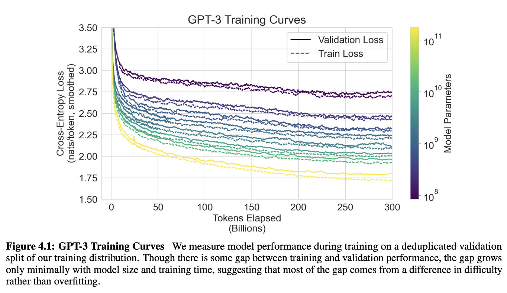

# GPT-3

📜 [Language Models are Few-Shot Learners](https://arxiv.org/pdf/2005.14165)

> Here we show that scaling up language models greatly improves task-agnostic, few-shot performance, sometimes even reaching competitiveness with prior state-of-the-art fine-tuning approaches.

> Specifically, we train GPT-3, an autoregressive language model with 175 billion parameters, 10x more than any previous non-sparse language model, and test its performance in the few-shot setting.

Again, GPT-3, like GPT-2 is not so much an introduction of new research methods as much as it is a practical implication of the principle that has been realized earlier - scaling laws are the direction of improvement.

> We discuss broader societal impacts of this finding and of GPT-3 in general.

> First, from a practical perspective, the need for a large dataset of labeled examples for every new task limits the applicability of language models.

> Second, the potential to exploit spurious correlations in training data fundamentally grows with the expressiveness of the model and the narrowness of the training distribution.

> Third, humans do not require large supervised datasets to learn most language tasks.

> Since in-context learning involves absorbing many skills and tasks within the parameters of the model, it is plausible that in-context learning abilities might show similarly strong gains with scale.

> In this paper, we test this hypothesis by training a 175 billion parameter autoregressive language model, which we call GPT-3, and measuring its in-context learning abilities.

### Results

All you need is scale! These training curves show that increase model parameters significantly decreases cross entropy loss.

### Limitations

> First, despite the strong quantitative and qualitative improvements of GPT-3, particularly compared to its direct predecessor GPT-2, it still has notable weaknesses in text synthesis and several NLP tasks.

> A more fundamental limitation of the general approach described in this paper – scaling up any LM-like model, whether autoregressive or bidirectional – is that it may eventually run into (or could already be running into) the limits of the pre-training objective.

> Finally, GPT-3 shares some limitations common to most deep learning systems – its decisions are not easily interpretable, it is not necessarily well-calibrated in its predictions on novel inputs as observed by the much higher variance in performance than humans on standard benchmarks, and it retains the biases of the data it has been trained on.

### Broader Impacts

This section doesn’t say anything too unintuitive, but seems to be more about the optics of them having considered the safety aspects of the model now that it has reached a level that’s potentially harmful.

However, it’s interesting to see the effects of how society has quickly adjusted to it’s awareness of AI and algorithms working around it through memetics. Social media has rapidly scaled awareness of AI.

### Conclusion

> We presented a 175 billion parameter language model which shows strong performance on many NLP tasks and benchmarks in the zero-shot, one-shot, and few-shot settings, in some cases nearly matching the performance of state-of-the-art fine-tuned systems, as well as generating high-quality samples and strong qualitative performance at tasks defined on-the-fly

> Despite many limitations and weaknesses, these results suggest that very large language models may be an important ingredient in the development of adaptable, general language systems.

