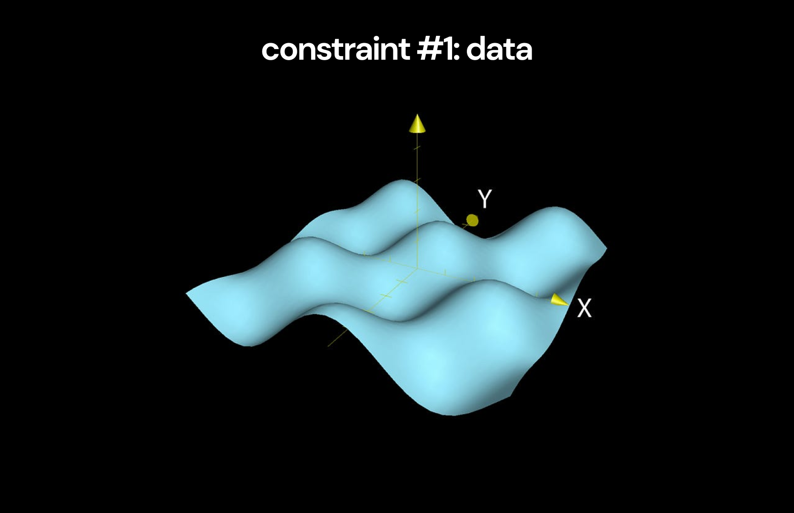
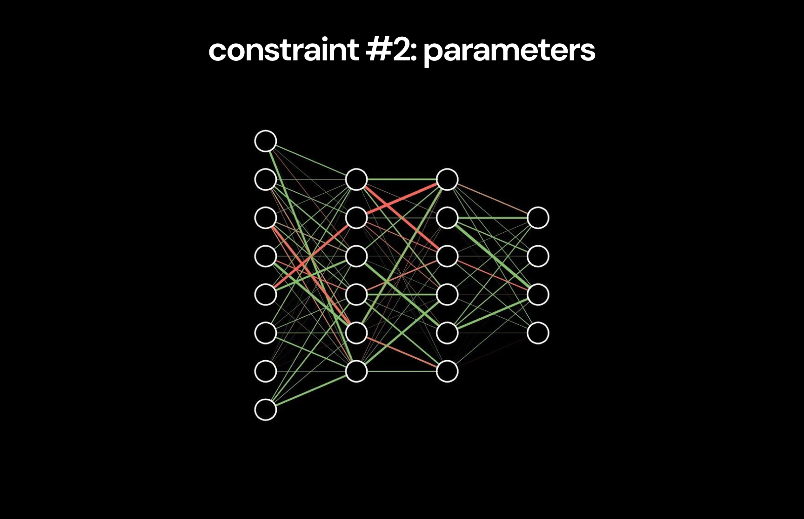
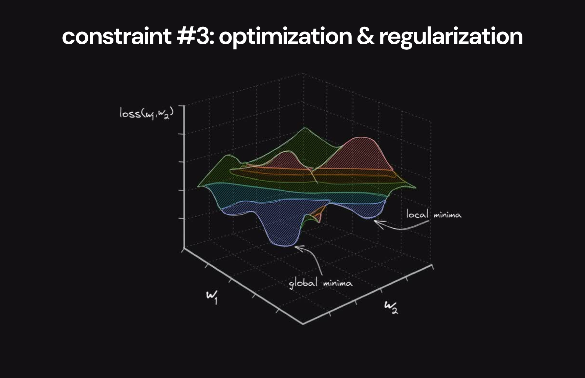
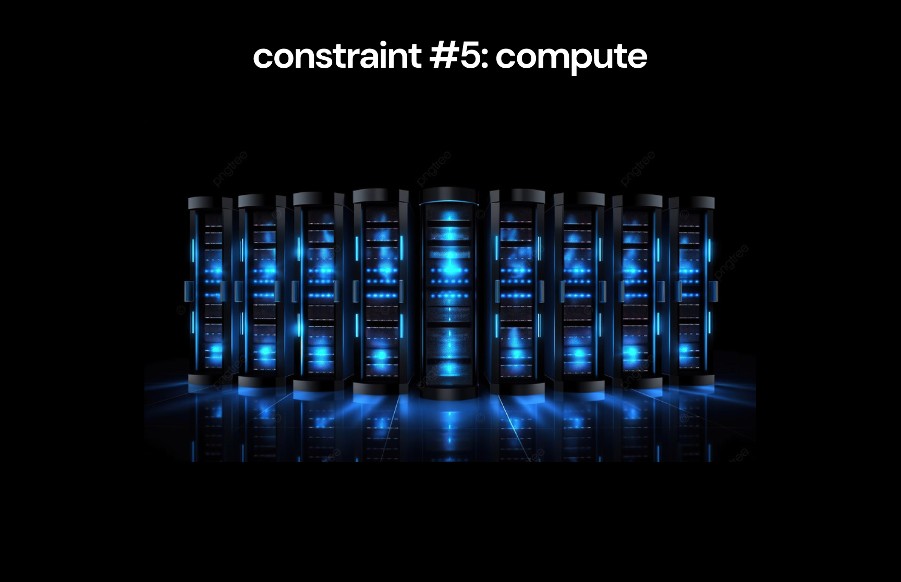
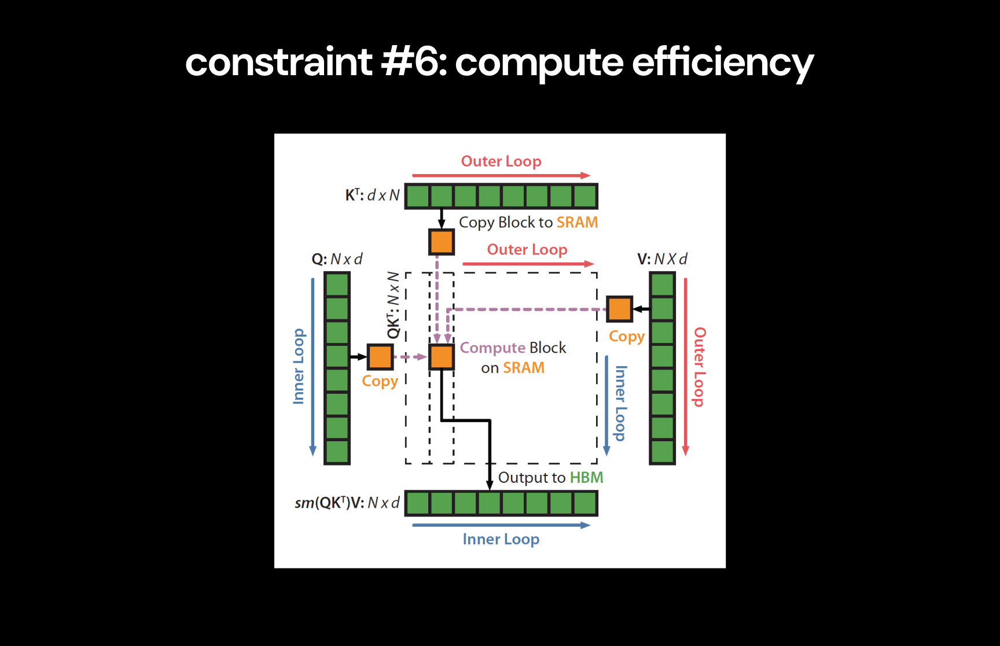
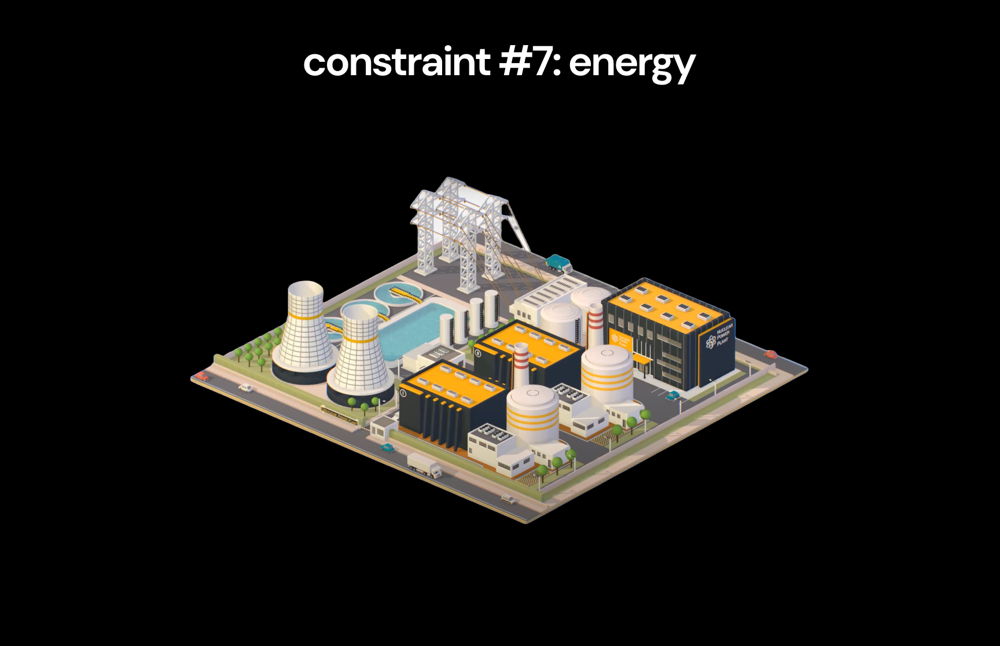

# deep-learning
  深度学习

A deep-dive on the entire history of deep learning, highlighting the series of innovations that got us from simple feed-forward networks to GPT-4o.

这里深入了整个深度学习的历史，重点提到了一系列的创新，其使得我们从简单的前向网络直到今天的GPT-4o。

For each key milestone, I've included the critical papers in this repository, along with my notes, my explanation of important intuitions & math, and a toy implementation in pytorch when relevant.

对于每一个关键的里程碑，我们已经包含了关键的论文在这个仓库中，包括我的观点，直观和数学上的解释，以及对相关内容的pytorch实现的小案例。

The rest of this page is my breakdown of everything we can learn from this history, and what it tells us about the future of deep learning, inspired by [_The Lessons of History_](https://www.amazon.com/Lessons-History-Will-Durant/dp/143914995X) by Will & Ariel Durant.

这一页的剩余部分是基于我对这段历史的一个划分，以及对于深度学习未来的一些想法，这是受到[_The Lessons of History_]的启发。

> [!IMPORTANT]
> 重点
> 
> **This project is designed so everyone can get most of the value by just reading my overview on the rest of this page.**
> 
> 这个项目是设计给每一个人去发现最大价值，但这需要去阅读本页剩余部分的观点
> 
> Then, people curious to learn about the technical details of each innovation can explore the rest of the repository via the links in the [resources](#resources) section.
> 
> 然后，有兴趣的人想要学习每一个创新的技术细节，可以看一下仓库的剩余部分，可以通过 [resources](#resources)直达。

> [!NOTE]
> 注意
> 
> Thanks to [Pavan Jayasinha](https://x.com/pavanjayasinha) and [Anand Majmudar](https://x.com/Almondgodd) for their constant feedback while I made this 😄
> 
> 感谢 [Pavan Jayasinha](https://x.com/pavanjayasinha) and [Anand Majmudar](https://x.com/Almondgodd) 的日常反馈对我的帮助。

## Table of Contents

- [Overview](#overview)
- 概览
  - [1. Constraints](#2-constraints)
  - 1.约束
    - [1.1. Data](#11-data)
    - 1.1 数据
    - [1.2. Parameters](#12-parameters)
    - 1.2 参数
    - [1.3. Optimization & Regularization](#13-optimization--regularization)
    - 1.4 优化和正则化
    - [1.4. Architecture](#14-architecture)
    - 1.4 架构
    - [1.5. Compute](#15-compute)
    - 1.5 计算
    - [1.6. Compute Efficiency](#16-compute-efficiency)
    - 1.6 计算效率
    - [1.7. Energy](#17-energy)
    - 1.7 能源
    - [1.8. Constraints & Leverage](#18-constraints--leverage)
    - 1.8 约束和应用
  - [2. Narratives](#2-narratives)
  - 2.一些叙述
  - [3. Inspiration](#3-inspiration)
  - 3.启发
  - [4. Intelligence](#4-intelligence)
  - 4.智能
  - [5. Future](#5-future)
  - 5.未来
- [Resources](#resources)
- 资源
  - [Topics](#topics)
  - 主题
  - [Implementations](#implementations)
  - 实现
  - [Papers](#papers)
  - 论文

 

# Overview
  概览
  
The most interesting part of my deep-dive came from noticing a clear trend across all the key advancements, which has completely reframed how I understand deep learning:

我这里所深入的最有意思的部分是来自对所有关键进展和趋势的清楚论述，这完全重构了我的深度学习的理解。

> [!IMPORTANT]
> 重点
> 
> **There are 7 simple constraints that limit the capacity of digital intelligence:**
>
> 这里有7个简单的约束限制了数字智能的能力。
> 1. data
>    数据
> 2. parameters
>    参数
> 3. optimization & regularization
>    优化和正则化
> 4. architecture
>    架构
> 5. compute
>    计算
> 6. compute efficiency
>    计算效率
> 7. energy
>    能源
>
> **The entire history of deep learning can be seen as the series of advancements that have gradually raised the ceiling on these constraints**, enabling the creation of increasingly intelligent systems.
> 整个深度学习的历史能被看作一系列的提升，已经逐渐到达这些约束的上限，使得能构建逐渐智能化的系统。

It's impossible to understand where we're going without first understanding how we got here - and it's impossible to understand how we got here without understanding these constraints, which have always governed the rate of progress.
如果我们不首先理解所处的位置，将无法理解要去哪里——同时，也不可能不了解这些约束就能知道我们的现状，因为这些约束一直影响着进步的效率。

By understanding them, we can also explore a few related questions:
通过这些理解，我们也能探索一些新的相关问题：

- How is progress made in deep learning?
- 这些深度学习的进步如何做到的？
- Where do the ideas that drive progress in deep learning come from?
- 这些想法哪里来的，能驱动深度学习的进步？
- How have our narratives about digital intelligence changed over time?
- 我们如何论述数字智能随着时间的变化？
- What does deep learning teach us about our own intelligence?
- 深度学习能对我们自身拥有的智能有什么帮助？
- Where is the future of deep learning headed?
- 深度学习未来的方向在哪里？

So, let's start by understanding these constraints from first principles.
这样，让我们开始理解这些约束，基于第一性原理。

 

# 1. Constraints
  1.约束

We can define intelligence[^1] as the ability to accurately model reality[^2]. Practically, we're interested in models of reality that are useful for performing economically valuable tasks.

我们能定义智能为一种能力，可以准确的建模现实世界。实际上，我们关注现实世界的建模，可以用来实现一些有经济价值的任务。

The goal of deep learning is to produce accurate models of reality for these useful tasks by:

深度学习的目标是去生成准确的现实世界的模型用于这些任务：

1. Treating the true models that describe reality as complex probability distributions[^3]

   用正确的模型来描述真实的世界，使其成为一个复杂的概率分布。
2. Creating neural networks capable of modeling complex probability distributions

   创建神经网络的能力，去建模复杂的概率分布。
3. Training these networks to learn to model the probability distributions that underlie reality

   训练这些网络去学习建模概率分布，能表征真实世界。 

In this view, creating intelligence with deep learning involves just two steps:

从这个视角，创建智能用到深度学习，只是涉及两个步骤：

1. Collect useful information about reality (collect data)

   收集有用的关于真实世界的信息（收集数据）
2. Create a neural network that can effectively learn from this information (model data)

    创建一个神经网络，能有效的学习这些信息（模型数据）

The only way to increase the intelligence of our model is to improve how well we accomplish each of these steps.

唯一的方法去提升我们模型的智能，就是去提升我们要实现的每一个步骤。

With this in mind, we can look at the constraints that govern this process. Let's start by understanding the constraint on data.

基于这个想法，我们能看到这些约束涉及了这个过程。让我们开始理解数据上的这些约束。

 
[^1]: Everyone has different definitions of intelligence, all of which are useful in different contexts, and none of which capture the full picture of what this word means. People may disagree with the specifics of this definition. I've chosen this one for the sake of simplicity to clearly frame what we're trying to achieve with deep learning from an economic perspective- I'm less concerned with it's philosophical implications here.

 每一个人对智能有不同的定义，所有这些不同的定义都基于不同的领域，但是都无法完整的概括这个词的含义。人们可能不同意这个定义的论述。我已经有目的选择了一个简单清楚的描述，就是尝试去用深度学习实现经济角度的目标。我在这里没有关注其哲学的意义。
[^2]: Karl Friston's [Free Energy Principle](https://www.nature.com/articles/nrn2787) suggests that this definition of intelligence is also valid in the context of the brain (beware, the paper is explained with unnecessary mathematical complexity, but the core concept it describes is simple). Notably, intelligence systems create models of the world and then use those models to perform _active inference_ to modify their environments.

 Karl Friston的自由能量法则论述的这个智能的定义，也可以用在大脑相关的内容中（当心，这篇论文的了中包含了不必要的复杂数学，但是，核心概念的论述是简洁的）。注意，智能系统创建世界模型，并用这些模型去做活动的推理，来改变其环境。
[^3]: This idea may seem unintuitive at first. But it's actually saying something very simple: (1) reality has a set of rules that govern what happens (2) we can model these rules by assigning probabilities to what's likely to happen, given what has already happened (3) thus, these models are probability distributions. Again, the [Free Energy Principle](https://www.nature.com/articles/nrn2787) supports this view of modeling reality.
 
  这个想法首先看起来不够直观。但是其实际论述的事情很简单：（1）现实世界有一组规则能控制什么会发生（2）我们能建模这些规则，用了分配概率的方式，去定义什么要发生，量化已经发生的（3）因此，这些模型都是概率分布。而且，自由能量法则支持这个建模真实世界的观点。

## 1.1. Data
   1.1. 数据

We've established that the goal of deep learning is to model the probability distributions that describe reality.
我们已经构建了深度学习的目标，就是去建模概率分布去表达真实的世界。

Let's call the distribution that we're trying to model for a specific task the _true distribution_. In order to learn about the true distribution, we collect many samples from it. These samples make up a _dataset_.
我们把这些尝试建模一个特定任务的分布称为真实的分布。为了去学习这个真实的分布，我们在其之上收集大量的样本。这些样本构成了一个数据集。

The dataset contains some information about the true distribution, but it doesn't contain _all_ information about the true distribution[^4]. Because of this, the dataset represents an approximation of the true distribution, which we'll 
这个数据集包含了一些信息是关于真实分布的，但是没有包含这个真实分布的全部信息。因此，这个数据集近似的表征了这个真实分布，被我们称为经验分布。
call the _empirical distribution_.

**At best, we can expect our neural network to learn to model this empirical distribution[^5].**
最好的情况，我们能期望神经网络去学习建模这个经验分布。

However, our original goal was to model the true distribution. To account for this, we need the empirical distribution to be **a good approximation** of the true distribution. The quality of this approximation determines the cap of how 
但是，我们开始的目标是去建模真实的分布。因此，我们需要这个经验分布要成为一个很好近似的真实分布。
good a model trained on the dataset can get.
这个近似的质量决定了训练在这个数据集上的模型有多好。

This is the first constraint on the intelligence of a neural network.
这是关于一个神经网络智能上的第一个约束。

> [!NOTE]
> 注意
>
> **Constraint #1: A model can only be as good as the dataset it was trained on.**
> 约束#1：一个模型只能训练达到与其所用数据集一样的质量。
>
> Specifically, the cap on how well a model can approximate the true distribution is determined by how much information about the true distribution is contained within the dataset.
> 确切的，一个模型有多好的去近似真实的分布，是由包含在其训练数据集中的真实分布的信息数量决定。

 

[^4]: Assuming the true distribution we're trying to model is sufficiently complex to the point where including all information about it in the dataset would be intractable. This is almost always the case in deep learning.
      假设我们尝试建模的真实的分布是有足够的复杂性，而包含所有这些复杂性在训练数据集中是做不到的。这几乎在深度学习中一直存在。
[^5]: Assuming the model perfectly represents all information that exists within the dataset, which rarely happens.
      假设模型完美的表征了数据集中的全部信息，而这很少发生。

### A Good Approximation
### 一个很好的近似

To make the empirical distribution a better approximation of the true distribution, we need to include more information about the true distribution in the dataset.
要使得经验分布能更好的近似真实分布，我们需要包含更多的真实分布的信息到这个数据集中。

We can increase the total information in the dataset by the information in each individual sample (intuitively, this means using samples that are more informative for the relevant task).
我们能增加数据集中的总体信息，其中的每一个独立样本（直观上，这意味着用到的样本是对相关任务有更多的信息量）

We can also increase the information in the dataset by adding more samples that offer new information about the true distribution[^6].
我们也能增加数据的信息，通过加入更多的样本，共同关于真实分布的新信息。

**To simplify, there are two ways to improve the quality of the dataset:**
简单的说，有两个方法去提升数据集的质量：

1. data quality
   数据定性
3. data quantity
   数据定量

This is not because more data is always good[^7], but because we want more information about the true distribution in the dataset so the model can learn a sufficient approximation of it.
这不是因为更多的数据是一直很好的，而是因为我们想要更多关于真实分布的信息出现在数据集中，这样模型能学习到一个足够的近似结果。

With this understanding of the data constraint and how to improve the quality of datasets, we can look at how progress in this dimension has impacted the history of deep learning.
有了这个关于数据集约束和如何提升数据集质量的理解，我们能看到在这个维度上的进度如何能影响深度学习的历史进程。

 

[^6]: This is analogous to how adding more terms to a Taylor series yields a function closer to the original. Approximations improve with more information about the true function.
      这是模拟了如何加入更多的项给Taylor级数，得到一个更接近原始的函数。近似提升是通过更多的关于真实函数的信息做到。
[^7]: In fact, you can think of examples where more data makes no difference. For example adding the same image to a dataset (or two images similar to each other) doesn't improve the quality of the model created. It's because these new 
      事实上，我们能想到样本中的大部分数据没有差异。例如，加入相同的图片到一个数据集汇总（或两张一样的图片）不能提升创建模型的质量。这是因为这些新的数据点不能加入更多的关于真实分布的新信息。
data points don't add much new information about the true distribution.

### Breakthrough #1: Large Labeled Datasets
### 突破 #1：大型的标记数据集

Early machine learning relied on datasets collected by individual research teams. Despite the development of effective approaches to deep learning, datasets weren't large enough to prove their advantages.
早期的机器学习依赖于数据集都是由独立的研究团队收集。尽管有深度学习方法的有效发展，但是数据集不够大，导致无法证明其优点。

The introduction of datasets like [MNIST](https://en.wikipedia.org/wiki/MNIST_database) and [ImageNet](https://en.wikipedia.org/wiki/ImageNet) drastically increased the availability of high quality datasets large enough to effectively 
随着一些数据集的引入，如MNIST和ImagNet，显著的提升了高质量数据集的可用性，其足够大，可以用来训练深度学习模型。
train deep learning models.

Early [CNNs](/01-deep-neural-networks/02-cnn/03-cnn.ipynb) like [LeNet](/01-deep-neural-networks/02-cnn/02-le-net.pdf) and [AlexNet](/01-deep-neural-networks/03-alex-net/01-alex-net.pdf) used these datasets to show that deep neural 
早期的CNN，类似LeNet和AlexNet用到了这些数据集证明了
networks could compete with the traditional machine learning approaches used at the time.
深度神经网络能与同期的传统的机器学习方法竞争。

It's easy to take for granted the impact of these datasets now, as they have long been obsolete - but they clearly had a huge impact on the field. Notably, AlexNet, which [completely changed the field of deep learning](/01-deep-neural-
现在很容易确认这些数据集的影响力，因为这些都已经是过时的，但是这些都对领域有巨大的影响。特别是，AlexNet，其完全改变了深度学习的领域，而ImageNet数据集对其而言是不可或缺的。
networks/03-alex-net/01-alex-net.pdf), could not have existed without the creation of the ImageNet dataset.

**The introduction of large labeled datasets can be seen as the first breakthrough in pushing the data constraint toward larger datasets.**
引入了大型的标记数据集能被看作第一个突破，推动了数据约束向着更大的数据集发展。

Though useful, these datasets were inherently unscalable due to the manual labeling process they rely on. In order to push the data constraint to the next level with even larger datasets, a new approach to data was needed.
尽管有用，这些数据集实际是无法扩展的，因为都依赖于人工标记。为了推动数据约束朝着下一个层级更大数据集发展，就需要一个新的数据方法。

 

### Breakthrough #2: Unlocking the Internet
突破2：解锁互联网

The internet is the most obvious source of massive amounts of data that could plausibly be used for deep learning. However, it was initially unclear how to use this data to train a deep learning model.
互联网显然是海量的数据集源，能合理用于深度学习。但是，一开始不清楚如何用这些数据去训练一个深度学习模型。

Unlike labeled datasets, internet data is not created for a specific tasks, so it didn't appear to contain high quality data that could contribute to training a specific model. For this reason, internet data appeared to be unusable in 
不同于已标记的数据，互联网数据不是用于特定的任务的，这样其就不能包含高质量的数据，无法用来训练一个特定的模型。因此，互联网数据在深度学习的发展中有很长一段时间是无用的。
deep learning for a long time[^8].

[BERT](/04-transformers/02-bert/03-bert.ipynb) completely changed this. BERT popularized the **transfer learning** paradigm now used by all large language models (including [GPTs](/04-transformers/04-gpt/03-gpt.ipynb)) - the model was 
BERT完全改变了这一切。BERT主导了迁移学习的方法，现在被用到了所有的大型语言模型中（包括GPT）-
_pre-trained_ on a large portion of the internet (high quantity, unpredictable quality), and then _fine-tuned_ on smaller datasets (low quantity, high quality).
这个模型是预训练在一个大型的互联网数据集上（海量，无法预测的质量），并微调在更小的数据集上（很少数量，高质量）。

**For the first time ever, BERT showed that we could actually make internet-scale datasets useful.**
第一次，BERT证明了我们能让互联网上的数据集非常有用。

The results also shocked the broader tech community - for example, [causing a Google executive to express](https://x.com/TechEmails/status/1756765277478621620) that an AI system would inevitably replace Google search in the near future.
这个结果也振动了更大技术社区-例如，导致Goolge发布了一个声明，AI系统将不可避免的替代Google搜索，就在不远的将来。

For those curious, the [LoRA](/04-transformers/05-lora/02-lora.ipynb) paper further developed on why the transfer learning paradigm developed by BERT and used by all modern LLMs may be so effective.
为此，LoRA论文进一步研究发布了，为什么BERT提出的迁移学习方法并被所有的大语言模型使用，是如此的有效。

 

[^8]: There was not powerful enough compute or good enough architectures to process the scale of internet datasets effectively for a long time.
      很长一段时间，没有足够强大的计算，或足够好的架构去有效的处理互联网规模的数据集。

### Breakthrough #3: Training Assistants
突破3：训练辅助

[BERT](/04-transformers/02-bert/03-bert.ipynb) and the [GPTs](/04-transformers/04-gpt/03-gpt.ipynb) were technically impressive but didn't immediately reach the mainstream until the release of ChatGPT.
BERT和GPTs技术上很出色，但是没有立刻成为主流，知道ChatGPT的发布。

[InstructGPT](/04-transformers/06-rlhf/05-rlhf.ipynb) was the breakthrough that enabled this. It used [RLHF](/04-transformers/06-rlhf/) techniques to fine-tune the base GPT-3 model using a human generated dataset of question-answer 
InstructGPT是能做到这些的突破点。其用到了一些技术去微调基础的GPT-3模型，用到了一个人工生成的数据集，包括了成对的问答，作为一个非常有用的助手去提供很好的反馈。
pairs deemed good responses for a helpful assistant.

By learning to behave effectively as an assistant, InstructGPT created the practical communication style that enabled ChatGPT to succeed.
通过学习去有效成为一个助手，InstructGPT创建了实用的交流风格，使得ChatGPT成功。

**The success of InstructGPT is an indication of how high-leverage data quality can be when fine-tuning language-models.**
InstructGPT的成功证明了，在微调语言模型如何去高度的利用数据集质量。

Though many fine-tuned models existed before the instruct series, InstructGPT was far preferred to almost everything else at the time due to the high quality data it was trained on.
尽管大量微调后的模型在指令系列之前就出现了，InstructGPT几乎是那时其中最好的，这是因为其训练在高质量的数据上。

 

### Beyond Internet Data
超越互联网数据

How much more can we improve the quality of the datasets deep learning models are trained on to improve the capacity for models to become intelligent?
我们究竟要提升到怎样的数据集质量，使得深度学习模型在其上训练，能提升模型的能力，让其变得智能？

The amount of data generated on the internet is increasing exponentially, which should continue to provide a source of increasingly large datasets to train on[^9].
互联网上生成数据的数量是指数增长的，这样就能持续提供一个不断增长的大型数据集可以用作训练。

However, there's another question about the quality of the data on internet-scale datasets. We want our systems to model reality - whereas the internet can be understood as a (highly) lossy compression of the true laws of reality[^10].
但是，有另一个问题关于互联网规模的数据集的质量的。因为我们想要的系统是去建模真实世界-由于互联网能被理解成为一个（高度）有损压缩的真实世界法则。

Because of this, the abundance of humanoid robots may present a new means of data collection for deep learning models that gives direct access to information about reality - which makes [OpenAI & Microsoft's investment and collaboration 
因此，丰富的类人机器人可能展示了一个新的意义，即数据收集用于深度学习模型，能直接用到关于真实世界的信息-这变得特别有趣。

with Figure](https://www.reuters.com/technology/robotics-startup-figure-raises-675-mln-microsoft-nvidia-other-big-techs-2024-02-29/) particularly interesting.

Regardless, current scaling laws have shown that current models are far from reaching the capacity of the information available in internet-scale datasets, meaning we may be far away from the point where data becomes the constraint 
毫无疑问，当前的尺度法则已经证明了，当前的模型是远远没到容纳互联网数据集的可用信息的规模，也意味着我们还远没到数据成为约束的点。
again.

 

[^9]: This may not actually be sufficient to keep increasing the quality of models, as a recent [analysis of zero-shot learning](https://arxiv.org/abs/2404.04125) shows that large language models ability to perform tasks increases 
      这可能实际不足以保证模型的质量增长，如最近的analysis of zero-shot所论述的，大语言模型有能力实现执行任务的对数增长，相较于数据集中的相关数据量而言。
logartihmically with the amount of relevant data in the dataset.
[^10]: The internet is a lossy compression of the entirety of human knowledge, with lot's of noise (complex and contrasting intentions behind different posts). Additionally, human knowledge itself is a very lossy (and partially 
        互联网是一个有损压缩的人类知识的全集，有大量的噪声（复杂性，和不同发布者的带来的不同意图）。此外，人类知识本身是一个非常有损失（同时部分不准确）压缩的真实世界法则。
inaccurate) compression of the laws of reality.

### Modeling Data
建模数据

Now that we've understood the data constraint, we can explore what constrains how effectively the neural network can model the data.
现在，我们已经理解了数据约束，我们就能探索关于神经网络如何能有效建模数据的约束上。

This determines how close to modeling the empirical distribution the model will get, which corresponds with its intelligence.
这决定了建模经验分布的模型将有多接近真实分布，这关系到其智能性。

The first constraint that determines the capacity for the model to learn the empirical distribution is the number of parameters in the neural network.
第一个约束关于模型学习经验分布的容量，就是神经网络中的参数数量。

 

## 1.2. Parameters
        参数

The model needs to have enough _representational capacity_ to be able to learn the empirical distribution of the dataset.
模型需要有足够的表征能力去学习数据集中的经验分布。

This means the neural network needs to have parameters to provide enough degrees of freedom to accurately model the distribution. In practice, it's challenging to predict the minimal number of parameters needed to fully model a dataset.
这意味着神经网络需要有参数可以提供足够的自由度去准确的建模分布。实际上，预测全面建模一个数据集所需的最小参数量是有挑战性的事情。

However, when the amount of information in the dataset is far beyond what the network is capable of modeling, the easiest way to improve the network is to scale up the number of parameters - which can mean increasing the depth of the 
但是，当数据集中的信息量远远超过了建模能力，最简单的方法是去提升网络，通过增加参数数量的方式-这能均匀的提升网络的深度，
network and adding more parameters per layer.
并在每一层加入更多的参数。

With modern internet-scale datasets, the complexity is massive, so the approach of adding more parameters shows no signs of slowing down in terms of its efficacy at improving the intelligence of models.
用了现代互联网规模的数据集，就有了极大的复杂性，这样加入更多参数的方法，还没有出现在提升模型智能性上有放缓的迹象。

> [!NOTE]
>注意
> 
> **Constraint #2: The representational capacity of a model is bounded by the number of parameters it contains.**
> 约束 #2：一个模型的表征能力是受到其包含的参数量的制约。

In practice, we'll see that increasing the number of parameters in a neural network is actually a function of the other constraints.
实际上，我们将看到，增加神经网络中的参数量是与其它约束条件有函数关系。

Let's look at the times in the past where this constraint has been particularly relevant.
让我们看看过去发生的特别相关的一些约束。

 

### Breakthrough #1: Increasing Depth
### 突破 #1：增加深度

The earliest neural networks consisted of just a single input and output layer, heavily limiting their representational capacity.
最早的神经网络只有一个单一的输入和输出层，严重制约了其表征能力。

The original [backpropagation paper](/01-deep-neural-networks/01-dnn/01-dnn.pdf) discussed the addition of a hidden layer, adding more parameters to the network which significantly increased it's ability to represent more complex 
最初的反向传播论文讨论了加入一个隐藏层，加入更多的参数到网络中，能显著的提升其表征更复杂性的能力。

problems (like shift-registers, the XOR gate, etc. - all very simple examples, but impressive at the time).
一些问题（类似移动-寄存器，XOR门控，等。所有这些都是非常简单的例子，但是在那时让人印象深刻）。

[AlexNet](/01-deep-neural-networks/03-alex-net/02-alex-net.ipynb) is one of the clearest examples of increasing parameters leading to better models[^11] - the AlexNet architecture used 5 convolutional layers, far more than the previous 
AlexNet是其中最清楚的例子，其增加了参数得到了更好的模型-AlexNet架构中用到了5个卷积层，远远超过了前一个

largest CNN at the time, which enabled it to crush the previous best score in the ImageNet competition.
当时最大的CNN，这样使得其能压倒之前最好的成绩在ImageNet竞赛上。

However, early on, size appeared to be one of many factors constraining the improvement of models, rather than the most important constraint.
但是，早前，大小是约束模型提升的一个主要因素，超过了其它的因素。

 

[^11]: Although, AlexNet was the result of a large number of innovations that combined to make it so effective - the increase in network depth was complemented with a use of effective optimization & regularization methods and the use of 
尽管AlexNet是大量创新的结果，这些创新的组合使得其如此有效-在网络深度的提升，组合用到了优化和正则化的方法，并用GPU训练，
GPUs for training which enabled this increase in size.
这样使得大小得到了提升。

### Breakthrough #2: Scaling Laws
### 突破 #2：缩放法则

The [GPT](/04-transformers/04-gpt/) series made it clear that for internet datasets, scaling parameters appears to be sufficient to significantly increase model quality.
GPT系列证明，对于互联网数据集，缩放参数的做法是足以显著的提升模型的质量。

The scaling laws show no sign of letting up, which has motivated the current continued attempts at training larger and larger models.
缩放法则还没有显示出停止的迹象，这促使了当前继续尝试训练越来越大的模型。

  

  <i>Scaling laws for model performance as a function of parameters</i>
  缩放法则对于模型性能而言，类似一个参数化的函数。

**Importantly, the reason for this trend is not that increasing the number of parameters in a model always increases it's intelligence.** Instead, it's due to the fact that current models still don't have enough representational 
重要的是，出现这个趋势的原因并不是增加模型的参数量能一直提升其智能。而是由于事实上当前的

capacity to capture all the information in internet-scale datasets.
模型容量仍然不足以去表征互联网规模数据集的全部信息。

As mentioned previosly, increasing the number of parameters in a neural network is actually governed by the other constraints.
如之前所提到的，增加神经网络的参数量实际上是受到其它条件的制约。

 

## 1.3. Optimization & Regularization
## 1.3. 优化和正则化

约束-3-优化和正则化

In reality, you can't keep scaling up the number of parameters in a model and expect quality to keep increasing.Scaling up a model (via increasing the depth or the number of parameters per layer) introduces two new classes of problems.
现实中，你不可能持续放大模型的参数量，并期望其质量一直上升。放大一个模型（通过增加深度或每一层的参数量）引入了两种新类型的问题。

First, increasing the depth of a network can make it take far longer to converge to an optimal solution, or in the worst cases, can prevent the network from converging.
首先，增加一个网络的深度，将使得更难的收敛到一个最优解，或最在最坏的情况，可能导致网络不能收敛。

**The process of ensuring models can converge effectively, even as they grow in depth, is known as optimization.**
确保模型能有效收敛的过程，甚至在增加深度条件下，被称为优化。

Additionally, when you scale up the number of parameters in a model so it's representational capacity exceeds the complexity of the empirical distribution, the model can start fitting trivial _noise_ in the distribution. This effect is 
此外，当你放大模型的参数量，这样其表征能力超过了经验分布的复杂性，这个模型就开始拟合分布中的很小的噪声，

known as _overfitting_.
这个现象被称为过拟合。

**The process of regularization is used to ensure models learn useful _generalizations_ of the dataset and don't overfit to noise.**
正则化的过程被用来确保模型学习数据集中有用的泛化性，并不出现过拟合噪声的情况。

In practice, the actual depth of a network is constrained by the efficacy of the optimization & regularization strategies used.
实际上，一个网路的实际深度是受到约束的，即受所用到的优化和正则化策略的效率约束。

> [!NOTE]
> 注意
> 
> **Constraint #3: The efficacy of optimization & regularization approaches constrains the number of parameters a network can handle while still being able to converge and generalize.**
> 约束3：优化和正则化方法的效率约束一个网络的参数量能被处理，并仍然能保证收敛和泛化。

 

### Breakthrough #1: Taming Gradients
### 突破 #1：控制梯度

While training deeper neural networks with [backpropagation](/01-deep-neural-networks/01-dnn/02-dnn.ipynb), gradients start to get magnified or disappear, due to the compounding effects of multiplication by sequences of large or small 
尽管训练更深的神经网络实用反向传播，这些梯度开始放大或消失，这是由于混合了乘以一些列的很大或很小的权重的效果。

weights[^12].

**This is known as the vanishing and exploding gradients problem.**
这被称为梯度消失或爆炸的问题。

It's easy to forget how prohibitive this problem was - it completely prevented the effective training of networks beyond a few layers in depth, putting a significant constraint on the size of networks.
很容易忘记这个问题是如此的难以处理-这个问题导致网络无法有效训练，超过了网络深度问题点点，是关于网络大小的一个明显的制约。

The introduction of [residuals](/02-optimization-and-regularization/03-residuals/02-residuals.ipynb) via the [ResNet](/02-optimization-and-regularization/03-residuals/01-residuals.pdf) architecture completely solved this problem by 
出现了残差网络，通过ResNet架构，完全的解决这个问题，
creating _residual pathways_ for gradients to flow effectively through networks of arbitrary depth.
通过构建参与的小路，可以使得梯度流高效的用在任意深度的网络中。

This unlock removed a significant constraint on network depth, enabling much larger networks to be trained (which removed a cap on parameters that existed for a long time before this).
这个解锁移除了在网络深度上的约束，使得明显更大的网络能被训练（这移除了在参数上的障碍，这个问题存在很长时间）

 

[^12]: Understanding this section relies on a basic understanding of the fundamentals of the backpropagation algorith. [3blue1brown's neural network series](https://www.youtube.com/playlist?list=PLZHQObOWTQDNU6R1_67000Dx_ZCJB-3pi) is an 
       理解这一部分的内容，依赖于一个关于反向传播算法的基础性的基本理解。3bluebrown的神经网络系列课程是一个直观和有趣的介绍，如果你想了解细节的话。
intuitive and interesting introduction for anyone who wants to learn.

### Breakthrough #2: Network of Networks
###突破 #2：网络中的网络

[Dropout](/02-optimization-and-regularization/04-dropout/) introduced a critical regularization strategy that has been used in most networks after it's creation, notably contributing to the success of [AlexNet](/01-deep-neural-
提出操作引入了一个关键的正则化的策略，在其被发明之后被用到了大部分的网络中，使得AlexNnet取得了成功，
networks/03-alex-net/02-alex-net.ipynb) which initially popularized it.
因为其在一开始用到。

Conceptually, the ideal way to prevent a model from overfitting to a particular problem would be to train a variety of neural networks on the same problem and then take the average of their predictions. This process would cancel out the 
概念上，避免一个模型对一个特定问题出现过拟合，就是去训练一个多个神经网络在同一个问题上，然后平均这些网络的预测结果。这个过程将消除

noise fitted by each network, leaving only the true representations.
在每一个网络上的噪声拟合，仅仅得到正确的表征。

However, this naive approach was prohibitively expensive - training multiple large neural networks for a single problem costs more compute.
但是，这个原始的方法的开销难以承受-训练多个大型的神经网络用于一个单一的问题会产生大量的计算开销。

Dropout enabled a computationally effective equivalent approach involving randomly blocking out the effects of a subset of neurons in each training run[^13], effectively training an exponential number of sub-networks within a neural 
剔除操作能做到计算效果的方法等价，通过在每一次训练运行中，随机的去除掉一个神经元子集的影响方式，有效的在神经网络中训练一个指数数量的子网的方式，

network and averaging their predictions together.
并将这些子网的预测结果共同平均。

 

[^13]: This effect forces individual neurons to learn general representations useful in collaboration with a variety of other neurons, rather than co-adapting with neighboring neurons, which allows large groups of neurons to fit to 
这个效果是去强制独立的神经元去学习通用表征，能被用于和其它不同的神经元进行协作，而不是用来适应性调整相邻的一些神经元，后者将让很多分组的神经元去拟合噪声。
noise.

### Breakthrough #3: Taming Activations
### 突破 #3：控制激活

Another problem when training deep networks is that later layers suffer from improving while the activations of earlier layers change, potentially rendering their early stages of training useless.
另一个训练神经网络的问题是，激活前面的网络变化，当导致后面的网络层无法提升，潜在的说明在训练的早期环节渲染是没什么用的。

**This problem is known as internal covariate shift**, and also prohibitted the training of deeper networks.
这个问题被称为内部协变量偏移，也导致无法训练更深的网络。

The introduction of [Batch Normalization](/02-optimization-and-regularization/05-batch-norm/) and [Layer Normalization](/02-optimization-and-regularization/06-layer-norm/) solved this by forcing neuron activations into predictable 
通过引入批次归一化和网络层归一化方法，通过强制神经元激活用在可预测的分布

distributions, preventing the covariate shift problem..
中解决了这个协变量偏移的问题。

This breakthrough, combined with residuals, provided the basis for building much deeper networks. Layer Normalization in particular enabled the training of deeper reccurent models like [RNNs](/03-sequence-modeling/01-rnn/02-rnn.ipynb) 
这个突破，并组合了残差方法，提供了构建更深网络的基础。网络层归一化特别是能用在更深的循环模型，
and [LSTMs](/03-sequence-modeling/02-lstm/02-lstm.ipynb)'s that led to the innovations eventually resulting in the [Transformer](/04-transformers/01-transformer/02-transformer.ipynb).
如RNN和LSTM，这样最终发明得到Transformer。

 

### Breakthrough #4: Momentum
### 突破 #4：动量

The initial optimization algorithm, _stochastic gradient-descent_, involves taking a pre-determined step to update the parameters at each time-step.
初始化优化算法，随机梯度下降，涉及使用一个预先确定的步骤去更新每一个时间步骤上的参数。

In practice, this can be highly inefficient and hurt convergence[^14].
实际上，这样做是非常低效并不利于收敛。

The [Adam](/02-optimization-and-regularization/08-adam/02-adam.ipynb) optimizer introduced an efficient algorith to keep track of **adaptive moments** tracking the history of gradients throughout the optimization process. This allowed 
Adam 优化器包含了一个高效的算法，能确保追踪“自适应动量”，去追踪梯度在整个优化的过程中的历史。

the optimizer to adjust step-sizes based on past information, often leading to much faster convergence.
这使得优化器调整单步的大小是基于过去的信息，通常能做到明显更快的收敛。

[^14]: Specifically in parameter spaces with large variance in the gradients, a certain step-size may cause over-adjustments in certain parts of the landscape, and result in painfully slow changes in other cases.
特别是在参数空间中有很大的方差出现在梯度中，一个确定的单步大小可能导致过度调整出现在损失风景的确定部分，并导致痛苦缓慢的变化出现在其它的情况。

 

### The Forgotten Constraint
遗忘约束

The advancements mentioned above (and related developments) are all used in most models to date. For example, the [Transformer](/04-transformers/01-transformer/02-transformer.ipynb) 
之前提到的优势（和相关的进展）都是被用在大部分今天的模型中。

architecture uses [Dropout](/02-optimization-and-regularization/04-dropout/), [Layer Normalization](/02-optimization-and-regularization/06-layer-norm/02-layer-norm.ipynb), and[Residuals]
例如，Transformer架构用了Dropout，Layer Normalization，和Residuals在其架构中，

(/02-optimization-and-regularization/03-residuals/02-residuals.ipynb) throughout it's architecture, and was trained using the [Adam](/02-optimization-and-regularization/08-adam/)
并且在训练中用到了Adam

optimizer.
优化器。

Because of how effective they've been completely removing prior problems, optimization & regularization appear to be largely solved now.
因为之前的问题已经被完成很有效的解决，优化和正则化现在就被很大程度上解决了。

This is especially augmented by the fact that we're far from reaching the peak of the scaling laws on current internet-scale datasets, so overfitting is not a concern.
这种情况特别是被现实所强化，因为当前用到的缩放法则还远远没到抵达互联网规模的数据集的峰值，于是过拟合的问题不被关注。

**Despite this, it's important to remember that optimization & regularization are still real constraints on the size of neural networks**, although they no longer effect models in their 
尽管如此，很重要是要记住，优化和正则化仍然是神经网络上实实在在的约束，尽管这些在当前状态已经不再影响模型。
current state.

 

## 1.4. Architecture
## 1.4. 架构

约束-4-架构

We covered how increasing the number of parameters in a neural network increases its _representational capacity_. This can be understood as the networks ability to store _useful 
我们论述了如何增加神经网络中的参数量来增加其表征容量。这个方法能被理解为增强网络保存有用表征的能力，

representations_ that effectively model the empirical distribution.
于是可以建模经验分布。

By default, deep neural networks are forced to learn the most optimal ways to store representations for different problems.
默认情况，深度神经网络是被强制去学习最优路径去保存表征，用于不同的问题。

However, when we already know an effective method for the model to store useful representations relevant to a particular problem, it can be helpful to build the ability to store 
但是，当我们已经知道一个有效的方法用于模型去保存有用的表征去关联到一个特定的问题，这样有助于去构建保存表征到这个有用形式的能力，直接给模型。
representations in this useful form directly into the model.

**Building specific structures into the neural network design to make it easier for the model to store useful representations is known as adding inductive bias.**
构建特定结构到神经网络的设计中，使得能更容易的让模型去保存有用的表征，这被称为加入归纳偏置。

Desiging good neural network architectures into our models is about increasing the density of _useful representations_ in the model, meaning more efficient usage of parameters.
设计好的神经网络架构给我们的模型，就是关于增加模型中有用表征的密度，意味着更高效的使用参数。

In this way, improved architectures can achieve similar effects to scaling up parameters.
于是，提升后的架构能实现与增加参数方法类似的效果。

In practice, architectural advancements have made previously intractable problems (like image synthesis) possible for neural networks.
实际上，架构提升已经使得前一个难以处理的问题（类似图片合成）在神经网络中可行。

> [!NOTE]
>
> **Constraint #4: The quality of the network architecture constrains the representational capacity of a model.**
>约束 #4：网络架构的质量约束了模型的表征能力。

Technically, a deep neural network with non-linearities is capable of modeling any distribution, given a sufficient number of parameters[^15].
技术上，一个深度神经网络其非线性的特性是能去建模任意的分布，当前要基于给定的足够参数数量。

But in practicality, there are distributions with so much complexity that simple deep neural networks can't effectively model them[^16]. For these distributions, we turn to architectural 
但是在某些特殊情况，有一些分布包含了非常大的复杂性，导致简单的深度神经网络无法有效的建模。对于这些分布，我们就去做架构提升来解决这个问题。
advancements to make progress.

 

[^15]: This idea is explored in the original [backpropagation paper](/01-deep-neural-networks/01-dnn/01-dnn.pdf).
这个想法最开始在反向传播的论文中提到。

[^16]: For example, image classification, where individual pixel values are noisy and subject to a variety of transformations.
例如，图片分类，其中的独立像素值是有噪声的，并且服从一个不同的变换形式。

### Breakthrough #1: Learning Features
### 突破 #1：学习特征

The [Convolutional Neural Network](/01-deep-neural-networks/02-cnn/03-cnn.ipynb) was the first effective architecture that introduced a significant inductive bias into neural networks. 
这个卷积神经网络是第一个有效的架构，其引入了一个显著的归纳偏置到神经网络中。

The idea behind the CNN is directly inspired by the hierarchical processing of inputs from the brain's vision system.
CNN背后的思想是直接受到层次结构输入过程的启发，这来自大脑视觉系统。

CNNs use _feature maps_ that detect high-level features across images to implement the translational invariance that's critical to image recognition tasks.
CNN用了特征图，其探测图片中的高层级的特征，去实现平移不变性，这是图片识别任务的关键。

This provided a deep learning analogue to the manual feature engineering efforts often used before deep learning was proven.
这样得到的神经网络类似于手工特征工程，这通常被用在深度学习流行之前的工作中。

CNNs were critical for the initial adoption of deep learning - neural networks like [LeNet](/01-deep-neural-networks/02-cnn/02-le-net.pdf) and [AlexNet](/01-deep-neural-networks/03-alex-
CNN是最开始应用深度学习的关键工作，神经网络类似LeNet和AlexNet

net/01-alex-net.pdf) used the architecture to beat the state-of-the-art in image classification competitions. Additionally CNNs are still relevant in modern models with the [U-Net](/01-
用到了这个架构，打败了图片分类竞赛中的最好的方法。此外，CNNs仍然是与现代模型相关的，包括U-Net架构被用在现代模型中用于图片生成。

deep-neural-networks/04-u-net/02-u-net.ipynb) architecture being used in modern [Diffusion](/05-image-generation/03-diffusion/05-diffusion.ipynb) models for image generation.

 

### Breakthrough #2: Memory
###突破 # 2 ：内存

The [Recurrent Neural Network](/03-sequence-modeling/01-rnn/02-rnn.ipynb) introduced the ability to store memories about the past to inform future decisions.
循环神经网络引入了一些能力，可以保存记忆是关于过去，可以强化未来的决策。

While theoretically interesting, it remained largely ineffective for sequence-modeling tasks until the introduction of the [Long Short-Term Memory](/03-sequence-modeling/02-lstm/02-
尽管理论上很有意思，其有很大的无效性在学列建模的任务上发生，直到出现了长短时记忆架构，

lstm.ipynb) architecture which enabled neural networks to learn complex relationships across time and space by learning to store, retrieve, and [forget](/03-sequence-modeling/03-learning-
其使得神经网络可以学习复杂的关系跨越时间和空间，通过学会保存，
to-forget/02-learning-to-forget.ipynb) memories over long time horizons.
检索和遗忘记忆的方法在一个长时间的范围。

**The LSTM inductive bias made them effective at sequence-modeling tasks, kicking off the arc of progress that eventually led to the creation of the Transformer.**
这个LSTM归纳偏置使得其能有效的用在序列建模的任务上，拉开了进步的弧线，最终为Transformer出现奠定了基础。

Despite their efficacy, the LSTM was constrained by the fact that it processed input sequences sequentially, making it slow to train.
尽管这个方法有效，但是LSTM事实上受限于其处理输入序列的顺序性要求，使得其训练很慢。

 

### Breakthrough #3: Attention
### 突破 #3：注意力

The [Attention](/03-sequence-modeling/06-attention/02-attention.ipynb) mechanism was initially introduced as an addition to LSTMs to enhance their ability to understand the relationship 
注意力机制是最初作为LSTM的修补出现，为了增强其能力去理解概念之间的关系。
between concepts.

The now famous [_Attention Is All You Need_](/04-transformers/01-transformer/01-transformer.pdf) paper removed all the LSTM components and demonstrated that the inductive bias of 
现在有名的注意力是所有所需要的这篇论文移除了全部的LSTM部分，
attention alone is effective for sequence-modeling tasks, introducing the [Transformer](/04-transformers/01-transformer/02-transformer.ipynb) architecture which has permanently changed 
并验证了归纳偏置的注意力单独是可以有效的用于序列建模任务，引入了Transformer架构深远的改变了深度学习领域。
deep learning.

**The transformer is particularly effective not just because of the power of the attention mechanism, but because of the high parallelization it achieved by removing recurrence.**
Transformer是特别有效，不仅仅因为其注意力机制的能力，也因为其高度的并发性，这是通过剔除了循环实现的。

 

### Breakthrough #4: Harnessing Randomness
### 突破 #4 利用随机性
The CNN introduced the ability to understand samples from the complex distribution of images.
CNN引入了一种能力，去理解图片中复杂分布的样本。

However, the problem of synthesizing images appeared to be much harder - CNNs could learn to filter out the details in images and focus on high-level features, whereas image geneartion models would need to learn to create both high-level features and complex details.
但是，合成图片中的问题将变得更难-CNN是能学习去过滤出图片中的细节，并聚焦在高层的特征上，由于图片生成模型将需要去学习同时创建高层的特征和复杂的细节。

Image generation models like [Variational Auto-Encoders](/05-image-generation/02-vae/04-vae.ipynb) and [Diffusion](/05-image-generation/03-diffusion/05-diffusion.ipynb) models learn to generate both high-level features and complex details by introducing random sampling and noise directly into their architectures.
图片生成模型，类似变分自动编码器和扩散模型，学习去同时生成高层的特征和复杂的细节，通过引入随机采样和噪声，直接用到这个架构中。

VAEs create a bottleneck that forces the models to learn useful representations in a low dimensional space. Then, they add back noise on top of these representations through random sampling. **So VAEs start by learning representations, and then add noise.**
VAE创建了一个瓶颈，强制模型去学习有用的表征低纬度空间。然后，其加回噪声到这些表征的顶部，通过随机采样的方式。“这样VAE开始是通过学习表征，并随即加上噪声”

**Diffusion models, instead, starts with noise, and learn to add information into to the noise slowly.**
扩散模型，而是，开始用到噪声，并学习去缓慢加入信息到噪声。

Without these designs, modern image generation models like [Stable Diffusion](https://arxiv.org/abs/2112.10752) and [DALL E](/05-image-generation/05-dall-e/) wouldn't exist.
没有这些世界，现代的图片生成模型，类似稳定扩散和DALLE将不会村子。

 

### Breakthrough #5: Embeddings
### 突破 #5：嵌入

The [Word2Vec](/03-sequence-modeling/04-word2vec/03-word2vec.ipynb) model popularized the concept of text embeddings that preserve semantic and syntactic meaning by forcing models to create vector representations for concepts with interesting properties.
这些Word2Vec模型推动了文本嵌入的概念，这样保留予以和句法的含义，通过强制模型去创建向量表征，用在一些有趣特征的概念表征。

A commonly used example of the power of such embeddings is that the following equation holds true in the embedding space: Emedding("King") - Embedding("Man") + Embedding("Woman") = Embedding("Queen").
一个通常被用到的例子关于这些嵌入的能力，是沿用了同等保持正确的在嵌入空间：嵌入（“国王”）-嵌入（“男人”）+嵌入（“女人”）=嵌入（“王后”）

Embeddings show us how the relationships between concepts can be represented in a highly condensed format.
这些嵌入显示了在这些概念之间的关系，能被表征为高度浓缩的关系。

Later models like [CLIP](/05-image-generation/04-clip/02-clip.ipynb) based on the [Transformer](/04-transformers/07-vision-transformer/02-vision-transformer.ipynb) architecture have led to complex embedding spaces mapping understandings of concepts across modalities to a single representation space, enabling multi-modal models like [DALL E 2](/05-image-generation/05-dall-e/02-dall-e-2.pdf).
随后，类似CLIP的模型基于Transformer架构，已经得到了复杂的嵌入空间映射，从基于多个模态理解的概念映射到单一表征的空间，能使得多模态的模型，类似DALL E 2。

 

### "Don't Touch the Architecture"
### “不要触碰这些架构”

For the past several years after the introduction of the [Transformer](/04-transformers/01-transformer/02-transformer.ipynb), efforts have mainly been focused around scaling up the parameters and data fed into transformers without heavily adjusting the inductive biases.
对于在引入了Transformer之后过去的一些年，一些努力主要聚焦在放大参数和数据去使用到Transformer中，没有重大的去调整归纳偏置。

This suggests a stagnation in architectural improvement motivated by the efficacy of the Transformer, which may suggest something about the inherent efficacy of the inductive bias of [Attention](/03-sequence-modeling/06-attention/) in intelligence.
这样使得在提升Transformer效率来驱动的架构提升停滞不前，这样可能说明了智能中注意力的归纳偏置的某些固有的效率。

**This explicit desire not to change architectures anymore is [discussed by Andrej Karpathy in this clip](https://www.youtube.com/watch?v=9uw3F6rndnA).**
这个显示的愿望不会改变更多的架构，这在Andrej Karpartty的视频片段中讨论了。

Instead of changing base architectures, many state-of-the-art models have been combining different existing architectures together - for example, the [Diffusion](/05-image-generation/03-diffusion/05-diffusion.ipynb) model design uses the [U-Net](/01-deep-neural-networks/04-u-net/02-u-net.ipynb) underneath, and [DALL-E-2](/05-image-generation/05-dall-e/02-dall-e-2.pdf) uses both [CLIP](/05-image-generation/04-clip/02-clip.ipynb) (which is built with the [Vision Transformer](/04-transformers/07-vision-transformer/02-vision-transformer.ipynb)) and a [Diffusion](/05-image-generation/03-diffusion/05-diffusion.ipynb) model.
不同于改变基础架构的方法，大部分最好的模型已经被组合到不同现有的架构一块。例如，扩散模型设计用了U-Net作为底层，并且DALL-E-2同时用了CLIP（其构建用了Vision Transformer），和一个扩散模型。

The combination of different working architectures has also resulted in the increasing multi-modality of models, indicative in the recent [announcement of GPT-4o](https://openai.com/index/hello-gpt-4o/) which trains a single base model on a variety of modalities (likely combining a variety of architectures underneath, although the implementation details are unreleased.).
这个组合了不同工作的架构已经在不断增加的多模态模型出现，说明近期发布的GPT-4o训练了单独一个基础模型在一个多模态上（类似组合了一个多个底层的架构，尽管实现的细节没有公布）

 

## 1.5. Compute

Assuming an efficient architecture and effective optimization & regularization, the last constraint on the total number of parameters and representational capacity in a model is **compute**.

During training, the gradient for each parameter needs to be computed and updated at each time-step, which costs computational resources. **So, with more parameters, there are far more computations during back-propagation which becomes the limiting step.**

Because of this, a single device can train a finite number of parameters at once, and beyond this, training has to expand to multiple devices at once to parallelize.

**And if there's a limit on the number of devices we can use for training, we hit a constraint on compute.**

So we can train a certain number of parameters per device. And then we need to get more devices. And if there's a limit on how many devices we can use together, we've hit a constraint on compute.

> [!NOTE]
>
> **Constraint #5: The total available compute constraints the maximum number of trainable parameters a model can have.**

In practice, the constraint may be caused by a lack of resources (to buy devices), supply (due to constrained supply chains), or energy (discussed later)[^17].

 

[^17]: There are also many engineering challenges with training on increasingly large clusters of devices like GPUs that need to be able to communicate with each other.

### Breakthrough #1: Communicating Compute

[AlexNet](/01-deep-neural-networks/03-alex-net/02-alex-net.ipynb) was one of the first major deep learning applications that took advantage of the parallelization capacity of GPUs to train neural networks.

They were also the first people to train a deep learning model across multiple GPUs at once to speed up training.

**They were able to accomplish this because of the recent addition of the ability for NVIDIA GPUs to write to each others memory**, which enabled much faster direct communication between GPUs rather than communicating through the host machine.

This innovation (introduced due to gaming, not deep learning), has become critical in training large models, where communication between large clusters of GPUs has become essential.

This paper pushed the compute constraint in several ways - first, just by using GPUs for training the first place, and additionally by using multiple GPUs to shard training, and using inter-GPU communication.

 

### Breakthrough #2: Riding Tailwinds

Until the past decade, the GPUs that have enabled deep learning to progress so far were driven forward not by the incentives of deep learning (which offered scarce revenue opportunity early-on for large companies like NVIDIA), but by the tailwinds of the gaming market.

In this way, deep learning benefited from a bit of luck - the compute tailwinds created by the gaming industry enabled deep learning to take off in a way that likely would not have happened in the absence of gaming.

**The gaming industry raised the constraint on compute for deep learning models by creating a sufficient financial incentive to produce GPUs of increasing quality.**

Through the trail of papers, you can see the quality of compute slowly get better over time, even before dedicated AI compute was created.

 

### Breakthrough #3: AI Gets Prioritized

Finally, in 2020, NVIDIA released their A100 model built specifically for AI applications, as they determined that AI was a strategic bet worth taking. This decision has now yielding the H100, and soon B100 GPUs that will power much of AI training.

  

  <i>Jensen Huang delivering an H200 to early OpenAI</i>

 

### Breakthrough #4: The Compute Arms Race

It wasn't initially obvious that acquiring compute would become a huge constraint.

The power laws trend that first became visible with [BERT](/04-transformers/02-bert/01-bert.pdf), [RoBERTa](/04-transformers/02-bert/02-roberta.pdf), [GPT-2](/04-transformers/04-gpt/01-gpt-2.pdf), and [GPT-3](/04-transformers/04-gpt/02-gpt-3.pdf) made it clear that scaling up parameters, and thus compute, was a necessary factor of increasing model intelligence.

As this trend became more clear and the AI narrative became more powerful, everyone began to acquire the necessary compute, leading to a demand volume that wasn't previously predicted by the supply-chain. This has caused a constraint in acquiring compute.

**In addition, the raw cost of acquiring a large amount of compute has become prohibitively expensive for most players.**

These constraints on compute led [Sam Altman to say that "compute is going to be the currency of the future."](https://www.youtube.com/watch?v=r2UmOBrrRK8)

[Zuck spent several billion to buy 350,000 NVIDIA GPUs](https://www.pcmag.com/news/zuckerbergs-meta-is-spending-billions-to-buy-350000-nvidia-h100-gpus), which now appears to be an act of incredible foresight considering the current struggle to get compute.

This increased demand for compute has also been reflected in the surging market caps of all the essential companies in NVIDIA's compute supply chain including TSMC & ASML.

 

### Adjusting Supply Chains

The current constraint on compute is partially a result of compute supply chains not having predicted the unexpected jump in demand caused by the AI boom.

As supply chains inevitably adjust to meet these demands, the constraint will likely shift from who has already obtained the most compute to who has the resources to purchase the most compute, which also positions OpenAI well considering their partnership with the well-resourced Microsoft.

 

### AI ASICs

In recent fundraising cycles, many startups have raised money to build dedic-ated AI chips for inference and training, promising to further speed up the efficiency of training large models.

These specialized chips, broadly known as **Application Specific Integrated Circuits**, build assumption about how deep learning models work directly into hardware, offering the ability to drastically accelerate training.

The question is, will other companies be able to compete in this space, or will NVIDIA maintain it's domination of the AI training market (most likely).

 

## 1.6. Compute Efficiency

While the power of compute increases, making effective use of this compute is not a guarantee. Using compute efficiently is a software problem that takes active effort and optimization.

Innovations like [FlashAttention](https://arxiv.org/abs/2205.14135), which drastically accelerated the speed of Transformers through an optimization in how attention access memory, are a reminder that compute optimizations are another lever to increase the efficiency of training and scale up models.

> [!NOTE]
>
> **Constraint #6: The software implementations for training constrain the efficiency of compute utilization.**

 

### Breakthrough #1: CUDA

Initially, GPUs were challenging to work with as they depended on a completely new programming paradigm.

The introduction of [CUDA](https://en.wikipedia.org/wiki/CUDA) as a GPU programming paradigm familiar to C programmers made writing GPU code far more approachable.

This language enabled [AlexNet](/01-deep-neural-networks/03-alex-net/01-alex-net.pdf) to manually implement their own kernels to speed up the convolution operation on GPUs, unlocking a new level of parallelization for training CNNs.

 

### Breakthrough #2: Kernel Libraries

People rarely have to write low-level kernels anymore since popular libraries like [PyTorch](https://pytorch.org/) and [JAX](https://github.com/google/jax) have already written the kernel code for the most popular kernels, making it easy for modern deep learning engineers to use GPUs without needing to dip into low-level code.

 

### Continuous Improvement

Despite the fact that GPU kernels are now largely written, there are likely still plenty of opportunities for improving the compute efficiency of model implementations - notably, the introduction of [FlashAttenion](https://arxiv.org/abs/2205.14135) demonstrated how big of a difference these changes could make in terms of training efficiency.

 

## 1.7. Energy

**Finally, even if the compute supply chains are capable of supporting all demand, and we have infinite resources to purchase compute, there is still a constraint on compute: energy**

In practice, large training runs need to be run on physically clustered compute in large data centers since the devices need to communicate with each other.

As the amount of devices in large training runs grows, datacenters will need to be able to support the energy needs of these devices.

This may actually become a meaningful constraint, as [Zuck discussed in this clip on the Dwarkesh podcast](https://www.youtube.com/watch?v=i-o5YbNfmh0).

Specifically, energy grids are limited to allowing a certain amount of energy being drawn from them in a location, meaning there's a cap to how large data-centers can become before they run into problems that require energy permitting and dipping into much slower government regulated processes.

> [!NOTE]
>
> **Constraint #7: The energy available to draw from the grid in a single location constrains the amount of compute that can be used for a training run.**

As many companies plan to build large data-centers for AI training, we'll see how the energy constraint plays out - notably, [Microsfot and OpenAI are rumored to be launching a $100B data-center project](https://www.reuters.com/technology/microsoft-openai-planning-100-billion-data-center-project-information-reports-2024-03-29/).

 

## 1.8. Constraints & Leverage

Having covered each constraint individually, we can now put them all into perspective in relation to the broader arrow of progress in deep learning.

**A helpful way to think about the 7 constraints is in terms of _hard constraints_ and _leverage_.**

The hard constraints are **data**, **compute**, and **energy** - these are rate-limited by slow processes - data currently being limited by the scaling growth of the internet and other data collection methods, compute being limited by individual company resources and supply chains, and energy constraints eventually being rate-limited by regulation.

Meanwhile, **parameters**, **optimization & regularization**, **architecture**, and **compute efficiency** can be thought of as forms of **leverage** on the hard constraints - they are all easy to vary and can be optimized to maximize a models intelligence given a fixed set of data, compute, and energy.

**Maximizing leverage constraints are important for individual training runs, but improving the hard constraints is what really pushed forward the increasing base intelligence of models now.**

This is again indicative of the scaling laws - our models have not shown signs of coming close to fully modeling the information in current internet-scale datasets, so we continue to scale up models by increasing _compute_ and _parameters_

 

# 2. Narratives

We can look back at this history of progress in deep learning through the lens of constraints, and see a few key milestones that stand out above the rest which have completely shifted narratives around deep learning.

Since narratives are a powerful tool for allocating capital and talent toward problems[^18], these narrative shifts alone have had a significant impact on deep learning progress.

 

[^18]: For those curious, [Kevin Kwok's essay on Narrative Distillation](https://kwokchain.com/2021/09/29/narrative-distillation-1/) an excellent exploration of the power of narratives in capital and resource allocation.

### Narrative #1: Deep Learning Works

The first major narrative shift in deep learning occured after the release of [AlexNet](/01-deep-neural-networks/03-alex-net/01-alex-net.pdf) in 2012.

Prior to this paper, deep learning was considered inferior to traditional ML, as it consistently lost to manual feature engineering approaches in image classification and other challenges.

The success of AlexNet brought down the top-5 error rate on the ImageNet challenge from 25.8% to 16.4%, blowing the previous state-of-the-art out of the water.

This directly enabled further innovations like [GoogLeNet](https://arxiv.org/abs/1409.4842) and [ResNet](/02-optimization-and-regularization/03-residuals/02-residuals.ipynb), but more importantly, it shifted attention back on deep learning and created new interest in the field.

The narrative shift that occured as a result of this work was from one of skepticism about the utility of deep learning to belief that it was a viable, and even superior approach to traditional machine learning.

This narrative shift was essential to get us to the point that we're at today, and it seems that Ilya Sutskever (who co-authored AlexNet) realized how scaling laws would playout long before it reached consensus, as [discussed in this interview with Geoffrey Hinton](https://www.youtube.com/watch?v=n4IQOBka8bc).

 

### Narrative #2: Internet Scale Data

The [_Attention Is All You Need_](/04-transformers/01-transformer/02-transformer.ipynb) paper created a massively parallelizable architecture that enabled training on internet scale datasets.

The introduction of the Transformer alone was not what created the largest narrative shifts though.

Arguably, it was the introduction of [BERT](/04-transformers/02-bert/03-bert.ipynb) that really showed how transformers could take advantage of massive datasets scraped from the internet via pre-training and fine-tuning, which kicked off the modern trends in AI focusing on achieving general intelligence.

Because of it's transfer learning approach, BERT achieved state-of-the-art results on many NLP tasks withou training on them explicitly, showing one of the first indications of some form of _generalized_ intelligence.

The shock caused by BERT is evident in the [Google executive statement](https://x.com/TechEmails/status/1756765277478621620) claiming that BERT will replace all the 20 years of progress on the search product.

 

### Narrative #3: Scaling Laws

The arrow of progress defined by the improvements from [GPT-2](/04-transformers/04-gpt/01-gpt-2.pdf) to [GPT-3](/04-transformers/04-gpt/02-gpt-3.pdf) onwards created the scaling laws narrative that dominates the current public sentiment.

Importantly, OpenAI took a bet on the scaling laws early on, well before they were widely recognized as being valid[^19]. A few years ago, most people thought the scaling laws were naive.

Now, they look clear in hindisght because of the series of bets OpenAI took to validate these laws, with GPT-2 and GPT-3 further validating their hypothesis.

**Extrapolating out the progression of scaling laws correctly is challenging** - as [Zuck points out in this clip](https://www.youtube.com/watch?v=i-o5YbNfmh0), trends like these rarely continue until we reach the goal - we usually run into bottlenecks and then have to readjust strategy.

In this context, the question is how far the empirical distribution of the internet dataset will take. Framed differently - how close is the empirical distribution of the internet to the true distribution of the model of reality?

This will determine when we hit a carrying capacity on how much better our models can get by scaling parameters to train on the internet.

**This narrative is also a good indicator of how impactful narratives are in fundraising.**

The AGI narrative may be the most powerful narrative in history since it can claim that "everything else economically valuable will be solved by this problem."

Clearly, this was used effectively with the [rumored $7T OpenAI fundraising attempt](https://www.wsj.com/tech/ai/sam-altman-seeks-trillions-of-dollars-to-reshape-business-of-chips-and-ai-89ab3db0) (which was of course just a rumor, but an indication of the power of the AGI narrative, since people believed it was a possibility).

 

[^19]: In Theil terms, you could frame this as OpenAI's "secret" or something they believe that others don't.

# 3. Inspiration

Where do the ideas that have led to breakthroughs in deep learning come from?

When we look at the history of progress, we can see several common sources of inspiration that appear frequently.

 

### Neuroscience

The most apparent source of direct inspiration for many advancements in deep learning is neuroscience.

The [CNN](/01-deep-neural-networks/02-cnn/01-cnn.pdf) is almost directly inspired by the visual system in the brain, and it led to significant advancements in deep learning.

Similarly, the effectiveness of [ReLU](/02-optimization-and-regularization/02-relu/) is explained in terms of the energy efficiency of sparse representations for concepts in the brain.

Other systems, like the [LSTM](/03-sequence-modeling/02-lstm/02-lstm.ipynb) and [Attention](/03-sequence-modeling/06-attention/02-attention.ipynb) mechanisms appear to draw from neuroscientific concepts (memory and attention) on a surface level, although in reality, their implementations are more motivated by the math of neural networks and engineering to specific problems rather than they are directly modeled after the brain.

For example, the LSTM design is perfectly engineering to address the vanishing & exploding gradients problem in RNNs, and it happens that a long-term memory based system is an effective way to fix this problem.

This pattern suggests that rather than taking direct inspiration from neuroscience, **deep learning may have converged on similar approaches to how nature has built intelligence in the brain, partly through first principles.**

This is a nice ex-post rationalization, but may overly construct a clean narrative that doesn't actually reflect the situation.

Additionally, early papers seem to intentionally feel pressure to fit ideas into neuroscientific and biological justifications, even where there may not have been any.

[Dropout](/02-optimization-and-regularization/04-dropout/02-dropout.ipynb) struck me as the most blatant example of this, as they explain "one possible motivation" for dropout coming from animal sexual behavior, despite their prior explanation in the paper of dropout following from a rather logical line of thinking around regularization.

This seems to an attempt to make the architecture appear to correspond with biology after it was designed, rather than it actually serving as a source for inspiration (of course, I could be wrong about this).

 

### Linear Algebra & Calculus

Most notably, [backpropagation](/01-deep-neural-networks/01-dnn/02-dnn.ipynb) and [LoRA](/04-transformers/05-lora) are directly inspired by the math behind neural networks.

LoRA (low-rank adaptation) is directly a manipulation on how models are trained by taking advantage of a feature of linear-algebra (decomposing weight matrices into lower dimensionality matrices with fewer trainable parameters).

Similarly, advancements like [Residuals](/02-optimization-and-regularization/03-residuals/02-residuals.ipynb) were directly motivated by the nature of gradient flows within neural networks.

 

### Physics & Information Theory

Notably, [VAEs](/05-image-generation/02-vae/04-vae.ipynb) and [Diffusion](/05-image-generation/03-diffusion/05-diffusion.ipynb) models take inspiration from thermodynamics - specifically Langevin dynamics, as well as probability and information theory.

These systems involve noisy sampling, and these models turn to approaches used in similarly noisy systems in the real world for inspiration

 

### Engineering

In practice, most of the innovations in deep learning are actually more motivated by engineering problems in neural network design, and bear only surface-level resemblance to the apparent fields of inspiration.

 

# 4. Intelligence

What can this progression of progress in deep learning tell us about our own intelligence?

I'll try to be purely empirical here, since it's easy to dip into unbased philosophizing with this topic given it's subjective nature.

As we've disucssed, one way way to view intelligence (motivated by the [Free Energy Principle](https://www.nature.com/articles/nrn2787)) is as a measure of our ability to model complex distributions that describe reality, and then run active inference on these models to accomplish things in the world[^20].

It seems that the combination of data about reality (dataset vs. our senses), compute (transistors vs. neurons), and energy (electricity vs. food) along with scale (parameters vs. connections), and of course, an effective learning algorithm, yields systems that appear intelligent.

Additionally, the efficacy of various inductive biases offered by different architectes may indicate something inherent about the structure of the information they're trying to model.

For example, the effectiveness of the attention mechanism raises the question of why this inductive bias alone appears to be so effective at modeling data.

If intelligence is really just a function of data, compute, energy, and training, then it seems inevitable now that digital intelligence will soon surpass us.

 

[^20]: This view of intelligence also paints the framework of thinking in the WaitButWhy post [The Cook and the Chef: Musk's Secret Suace](https://waitbutwhy.com/2015/11/the-cook-and-the-chef-musks-secret-sauce.html) particularly well

# 5. Future

We've now reframed the history of progress as the series of advancements that have continually raised the ceiling on the constraints governing digital intelligence.

Everything in the past that has contributed to progress has been determined by the constraints discussed above.

Importantly, nothing about this changes in the future - **these same 7 constraints will always determine where we're headed, and how close we are to AGI.[^21]**

At this point, we've solved the _theoretical problem_ of AGI, in the sense that we know exactly what would get us to AGI[^22].

This was not obvious until the past decade, where we've seen the power of how far deep learning can go.

The question is now whether we will solve the _engineering_ problem of AGI. Will we be able to keep pushing on all the constraints to keep improving digital intelligence?

Although scaling laws are currently at play and the current path forward is to acquire larger amounts of compute to train larger models, the efficacy of this approach will hit a limit in the future (it's difficult to know when).

It's possible that we may hit a bottleneck in how good models can get based on the quality of the empirical distribution of the internet, in which case we'll have to seek other sources of data.

> [!IMPORTANT]
>
> It's critical to remember that the core principle of progress in deep learning is that pushing on the 7 constraints will lead to increasingly intelligence systems.
>
> Though the scaling laws indicate that the current limiting constraints are compute and parameters, these may shift to data and energy over time, which will bring new challenges.

 

[^21]: This is not saying that scaling laws will get us to AGI, but that constantly pushing the constraints will get us to AGI. We may run into bottlenecks that render the scaling laws obselete at some point.
[^22]: Assuming you believe that the current systems exhibit intelligent behavior, which some people still disagree with.

# Resources

## Topics

> [!IMPORTANT]
>
> Each topic highlighted in this repository is covered in a folder linked below.
>
> In each folder, you'll find a copy of the critical papers related to the topic (`.pdf` files), along with my own breakdown of intuitions, math, and my implementation when relevant (all in the `.ipynb` file).

**1. Deep Neural Networks**

- [1.1. DNN](/01-deep-neural-networks/01-dnn/)
- [1.2. CNN](/01-deep-neural-networks/02-cnn/)
- [1.3. AlexNet](/01-deep-neural-networks/03-alex-net/)
- [1.4. UNet](/01-deep-neural-networks/04-u-net/)

**2. Optimization & Regularization**

- [2.1. Weight Decay](/02-optimization-and-regularization/01-weight-decay/)
- [2.2. ReLU](/02-optimization-and-regularization/02-relu/)
- [2.3. Residuals](/02-optimization-and-regularization/03-residuals/)
- [2.4. Dropout](/02-optimization-and-regularization/04-dropout/)
- [2.5. Batch Normalization](/02-optimization-and-regularization/05-batch-norm/)
- [2.6. Layer Normalization](/02-optimization-and-regularization/06-layer-norm/)
- [2.7. GELU](/02-optimization-and-regularization/07-gelu/)
- [2.8. Adam](/02-optimization-and-regularization/08-adam/)

**3. Sequence Modeling**

- [3.1. RNN](/03-sequence-modeling/01-rnn/)
- [3.2. LSTM](/03-sequence-modeling/02-lstm/)
- [3.3. Learning to Forget](/03-sequence-modeling/03-learning-to-forget/)
- [3.4. Word2Vec & Phrase2Vec](/03-sequence-modeling/04-word2vec/)
- [3.5. Seq2Seq](/03-sequence-modeling/05-seq2seq/)
- [3.6. Attention](/03-sequence-modeling/06-attention/)
- [3.7. Mixture of Experts](/03-sequence-modeling/07-mixture-of-experts/)

**4. Transformers**

- [4.1. Transformer](/04-transformers/01-transformer/)
- [4.2. BERT](/04-transformers/02-bert/)
- [4.3. T5](/04-transformers/03-t5)
- [4.4. GPT-2 & GPT-3](/04-transformers/04-gpt)
- [4.5. LoRA](/04-transformers/05-lora)
- [4.8. RLHF & InstructGPT](/04-transformers/06-rlhf)
- [4.9. Vision Transformer](/04-transformers/07-vision-transformer)

**5. Image Generation**

- [5.1. GANs](/05-image-generation/01-gan/)
- [5.2. VAEs](/05-image-generation/02-vae/)
- [5.3. Diffusion](/05-image-generation/03-diffusion/)
- [5.4. CLIP](/05-image-generation/05-clip/)
- [5.5. DALL E & DALL E 2](/05-image-generation/06-dall-e/)

 

## Implementations

I've provided my minimal implementations for many of the core topics in this repository in the `.ipynb` files for each topic.

Generally, you can find good implementations of most papers online, which means the challenge isn't figuring out reimplementation. I've included these to collect them in one place for convenience, and also to highlight simple implementations that demonstrate each concept and I've gotten trained.

I used A100's to train most of the larger models.

- [DNN](/01-deep-neural-networks/01-dnn/02-dnn.ipynb)
- [CNN](/01-deep-neural-networks/02-cnn/03-cnn.ipynb)
- [Transformer](/04-transformers/01-transformer/02-transformer.ipynb)
- [LoRA](/04-transformers/05-lora/02-lora.ipynb)
- [Vision Transformer](/04-transformers/07-vision-transformer/02-vision-transformer.ipynb)
- [GAN](/05-image-generation/01-gan/02-gan.ipynb)
- [VAE](/05-image-generation/02-vae/04-vae.ipynb)
- [Diffusion](/05-image-generation/03-diffusion/05-diffusion.ipynb)

 

## Papers

**Deep Neural Networks**

- **DNN** - Learning Internal Representations by Error Propagation (1987), D. E. Rumelhart et al. [[PDF]](https://stanford.edu/~jlmcc/papers/PDP/Volume%201/Chap8_PDP86.pdf)
- **CNN** - Backpropagation Applied to Handwritten Zip Code Recognition (1989), Y. Lecun et al. [[PDF]](http://yann.lecun.com/exdb/publis/pdf/lecun-89e.pdf)
- **LeNet** - Gradient-Based Learning Applied to Document Recognition (1998), Y. Lecun et al. [[PDF]](http://vision.stanford.edu/cs598_spring07/papers/Lecun98.pdf)
- **AlexNet** - ImageNet Classification with Deep Convolutional Networks (2012), A. Krizhevsky et al. [[PDF]](https://papers.nips.cc/paper_files/paper/2012/file/c399862d3b9d6b76c8436e924a68c45b-Paper.pdf)
- **U-Net** - U-Net: Convolutional Networks for Biomedical Image Segmentation (2015), O. Ronneberger et al. [[PDF]](https://arxiv.org/abs/1505.04597)

**Optimization & Regularization**

- **Weight Decay** - A Simple Weight Decay Can Improve Generalization (1991), A. Krogh and J. Hertz [[PDF]](https://proceedings.neurips.cc/paper/1991/file/8eefcfdf5990e441f0fb6f3fad709e21-Paper.pdf)
- **ReLU** - Deep Sparse Rectified Neural Networks (2011), X. Glorot et al. [[PDF]](https://www.researchgate.net/publication/215616967_Deep_Sparse_Rectifier_Neural_Networks)
- **Residuals** - Deep Residual Learning for Image Recognition (2015), K. He et al. [[PDF]](https://arxiv.org/pdf/1512.03385)
- **Dropout** - Dropout: A Simple Way to Prevent Neural Networks from Overfitting (2014), N. Strivastava et al. [[PDF]](https://www.cs.toronto.edu/~rsalakhu/papers/srivastava14a.pdf)
- **BatchNorm** - Batch Normalization: Accelerating Deep Network Training by Reducing Internal Covariate Shift (2015), S. Ioffe and C. Szegedy [[PDF]](https://arxiv.org/pdf/1502.03167)
- **LayerNorm** - Layer Normalization (2016), J. Lei Ba et al. [[PDF]](https://arxiv.org/pdf/1607.06450)
- **GELU** - Gaussian Error Linear Units (GELUs) (2016), D. Hendrycks and K. Gimpel [[PDF]](https://arxiv.org/pdf/1606.08415)
- **Adam** - Adam: A Method for Stochastic Optimization (2014), D. P. Kingma and J. Ba [[PDF]](https://arxiv.org/pdf/1412.6980)

**Sequence Modeling**

- **RNN** - A Learning Algorithm for Continually Running Fully Recurrent Neural Networks (1989), R. J. Williams [[PDF]](https://gwern.net/doc/ai/nn/rnn/1989-williams-2.pdf)
- **LSTM** - Long-Short Term Memory (1997), S. Hochreiter and J. Schmidhuber [[PDF]](https://www.bioinf.jku.at/publications/older/2604.pdf)
- **Learning to Forget** - Learning to Forget: Continual Prediction with LSTM (2000), F. A. Gers et al. [[PDF]](https://citeseerx.ist.psu.edu/document?repid=rep1&type=pdf&doi=e10f98b86797ebf6c8caea6f54cacbc5a50e8b34)
- **Word2Vec** - Efficient Estimation of Word Representations in Vector Space (2013), T. Mikolov et al. [[PDF]](https://arxiv.org/pdf/1301.3781)
- **Phrase2Vec** - Distributed Representations of Words and Phrases and their Compositionality (2013), T. Mikolov et al. [[PDF]](https://arxiv.org/pdf/1310.4546)
- **Encoder-Decoder** - Learning Phrase Representations using RNN Encoder-Decoder for Statistical Machine Translation (2014), K. Cho et al. [[PDF]](https://arxiv.org/pdf/1406.1078)
- **Seq2Seq** - Sequence to Sequence Learning with Neural Networks (2014), I. Sutskever et al. [[PDF]](https://arxiv.org/pdf/1409.3215)
- **Attention** - Neural Machine Translation by Jointly Learning to Align and Translate (2014), D. Bahdanau et al. [[PDF]](https://arxiv.org/pdf/1409.0473)
- **Mixture of Experts** - Outrageously Large Neural Networks: The Sparsely-Gated Mixture-of-Experts Layer (2017), N. Shazeer et al. [[PDF]](https://arxiv.org/pdf/1701.06538)

**Transformers**

- **Transformer** - Attention Is All You Need (2017), A. Vaswani et al. [[PDF]](https://arxiv.org/pdf/1706.03762)
- **BERT** - BERT: Pre-training of Deep Bidirectional Transformers for Language Understanding (2018), J. Devlin et al. [[PDF]](https://arxiv.org/pdf/1810.04805)
- **RoBERTa** - RoBERTa: A Robustly Optimized BERT Pretraining Approach (2019), Y. Liu et al. [[PDF]](https://arxiv.org/pdf/1907.11692)
- **T5** - Exploring the Limits of Transfer Learning with a Unified Text-to-Text Transformer (2019), C. Raffel et al. [[PDF]](https://arxiv.org/pdf/1910.10683)
- **GPT-2** - Language Models are Unsupervised Multitask Learners (2018), A. Radford et al. [[PDF]](https://d4mucfpksywv.cloudfront.net/better-language-models/language_models_are_unsupervised_multitask_learners.pdf)
- **GPT-3** - Language Models are Few-Shot Learners (2020) T. B. Brown et al. [[PDF]](https://arxiv.org/pdf/2005.14165)
- **LoRA -** LoRA: Low-Rank Adaptation of Large Language Models (2021), E. J. Hu et al. [[PDF]](https://arxiv.org/pdf/2106.09685)
- **RLHF** - Fine-Tuning Language Models From Human Preferences (2019), D. Ziegler et al. [[PDF]](https://arxiv.org/pdf/1909.08593)
- **PPO** - Proximal Policy Optimization Algorithms (2017), J. Schulman et al. [[PDF]](https://arxiv.org/pdf/1707.06347)
- **InstructGPT** - Training language models to follow instructions with human feedback (2022), L. Ouyang et al. [[PDF]](https://arxiv.org/pdf/2203.02155)
- **Helpful & Harmless** - Training a Helpful and Harmless Assistant with Reinforcement Learning from Human Feedback (2022), Y. Bai et al. [[PDF]](https://arxiv.org/pdf/2204.05862)
- **Vision Transformer** - An Image is Worth 16x16 Words: Transformers for Image Recognition at Scale (2020), A. Dosovitskiy et al. [[PDF]](https://arxiv.org/pdf/2010.11929)

**Generative Models**

- **GAN** - Generative Adversarial Networks (2014), I. J. Goodfellow et al. [[PDF]](https://arxiv.org/pdf/1406.2661)
- **VAE** - Auto-Encoding Variational Bayes (2013), D. Kingma and M. Welling [[PDF]](https://arxiv.org/pdf/1312.6114)
- **VQ VAE** - Neural Discrete Representation Learning (2017), A. Oord et al. [[PDF]](https://arxiv.org/pdf/1711.00937)
- **VQ VAE 2** - Generating Diverse High-Fidelity Images with VQ-VAE-2 (2019), A. Razavi et al. [[PDF]](https://arxiv.org/pdf/1906.00446)
- **Diffusion** - Deep Unsupervised Learning using Nonequilibrium Thermodynamics (2015), J. Sohl-Dickstein et al. [[PDF]](https://arxiv.org/pdf/1503.03585)
- **Denoising Diffusion** - Denoising Diffusion Probabilistic Models (2020), J. Ho. et al. [[PDF]](https://arxiv.org/pdf/2006.11239)
- **Denoising Diffusion 2** - Improved Denoising Diffusion Probabilistic Models (2021), A. Nichol and P. Dhariwal [[PDF]](https://arxiv.org/pdf/2102.09672)
- **Diffusion Beats GANs** - Diffusion Models Beat GANs on Image Synthesis, P. Dhariwal and A. Nichol [[PDF]](https://arxiv.org/pdf/2105.05233)
- **CLIP** - Learning Transferable Visual Models From Natural Language Supervision (2021), A. Radford et al. [[PDF]](https://arxiv.org/pdf/2103.00020)
- **DALL E** - Zero-Shot Text-to-Image Generation (2021), A. Ramesh et al. [[PDF]](https://arxiv.org/pdf/2102.12092)
- **DALL E 2** - Hierarchical Text-Conditional Image Generation with CLIP Latents (2022), A. Ramesh et al. [[PDF]](https://arxiv.org/pdf/2204.06125)
